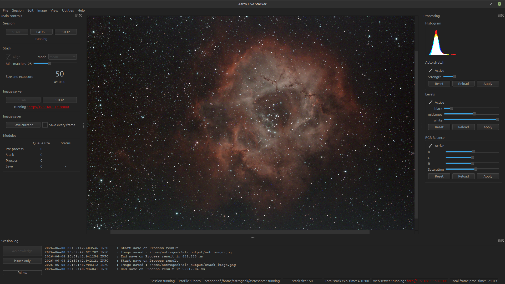

# 🛰️ Astro Live Stacker (ALS)

**Real-time astrophotography stacking for curious stargazers.**  
Because waiting until dawn to see your final stack is *so* 2010.

---

## 🌌 What is ALS?

**Astro Live Stacker** (ALS) aligns and stacks your deep-sky images *live*, as they come from your camera.  
It’s designed for astronomers who love both the night sky and open-source software — from casual backyard observers to
serious astrophotography addicts.

ALS runs on **Linux**, **Windows**, **macOS**, and even the **Raspberry Pi**.  
All you need is your camera, a clear sky, and a sense of wonder.

---

## 🔭 Main Features

- Multi-platform support (PCs and small boards alike)
- Hot pixel removal
- Automatic debayer
- Automatic dark calibration
- Real-time image alignment and stacking
- Live histogram
- Auto-stretch, levels and color balance
- Integrated web viewer for remote session sharing
- Open-source and community-driven spirit ✨

---

## 📚 Documentation

Full installation, configuration, and usage guides live on the official site:  
👉 [**ALS Documentation**](https://als-app.org/docs/)

It’s got screenshots, walkthroughs, and far fewer acronyms than you’d expect.

---

## 💾 Downloads

Ready-to-run builds for all major platforms are available here:  
➡️ [**GitHub Releases**](https://github.com/deufrai/als/releases)

Each release includes binaries and changelogs.

---

## 🤝 Community / Contributing

Found a bug, have an issue or a bright idea, or want to help stack some photons?

- Open an issue on [**GitHub**](https://github.com/deufrai/als/issues)
- Come talk with us on [**Discord**](https://als-app.org/discord)

Pull requests are very welcome — especially if they come with coffee ☕.

---

## 👨‍🚀 Maintainer & Credits

Originally built by the historical ALS Team,  
now proudly maintained by **Frédéric Cornu** — chief bug-whisperer and eternal stargazer.

ALS continues to live on thanks to everyone who reports bugs, tests builds, and shares their sky.

---

## ⚖️ License

Licensed under [**GPL-3.0**](LICENSE.txt).  
Free as in freedom — and photons.

---

## 🧭 Project Links

| Purpose          | Link                                                  |
|------------------|-------------------------------------------------------|
| 🌐 Documentation | [https://als-app.org/docs/v1.0](https://als-app.org/docs/v1.0) |
| 💾 Releases      | [https://github.com/deufrai/als/releases](https://github.com/deufrai/als/releases) |
| 🐞 Issue Tracker | [https://github.com/deufrai/als/issues](https://github.com/deufrai/als/issues) |
| 🪐 Website       | [https://als-app.org](https://als-app.org)                             |
| 🗣️ Discord       | [https://als-app.org/discord](https://als-app.org/discord)             |

---

> “Look up at the stars — and keep stacking.” ✨
