This section contains detailed documentation for each ALS module.

Modules can perform one or more processes on the images they receive.

If a module performs multiple processes, it hosts a list of processes that will be applied sequentially to the current image.

```mermaid
flowchart LR

    SCAN_FOLDER[Scan Folder] 
    
    subgraph Scanner 
        SCANNER_ENGINE[Engine]
    end
           
    subgraph Preprocess
        direction TB
        PREPROCESS_ENGINE[Engine]
        HOT_PIXEL[Hot Pixel Removal]
        DARK_SUB[Dark Subtraction]
        DEBAYER[DeBayer]
    end  
    
    subgraph Stack
        direction TB
        STACK_ENGINE[Engine]
    end
    
    subgraph Process
        direction TB
        PROCESS_ENGINE[Engine]
        STRETCH[Autostretch]
        LEVELS[Levels]
        COLOR_BAL[Color Balance]
    end 
    
    subgraph Save
        direction TB
        SAVE_ENGINE[Engine]
    end

    WEB_FOLDER[Web Folder]
    WORK_FOLDER[Work Folder]
    
    subgraph Server
        direction TB
        SERVER_ENGINE[Engine]
    end

    SCAN_FOLDER -.-> SCANNER_ENGINE
    
    SCANNER_ENGINE -.-> PREPROCESS_ENGINE
    PREPROCESS_ENGINE -.-> STACK_ENGINE
    
    STACK_ENGINE --> PROCESS_ENGINE
    PROCESS_ENGINE ---> SAVE_ENGINE
    PROCESS_ENGINE --> DISPLAY
    
    SAVE_ENGINE --> WEB_FOLDER
    SAVE_ENGINE --> WORK_FOLDER
    
    WEB_FOLDER --> SERVER_ENGINE

    style SCANNER_ENGINE fill:#333,stroke:darkred,stroke-width:2px,color:#c6c6c6,font-family:'Poppins',sans-serif
    style SERVER_ENGINE fill:#333,stroke:darkred,stroke-width:2px,color:#c6c6c6,font-family:'Poppins',sans-serif
    
    style PREPROCESS_ENGINE fill:#333,stroke:darkred,stroke-width:4px,color:#c6c6c6,font-family:'Poppins',sans-serif
    style STACK_ENGINE fill:#333,stroke:darkred,stroke-width:4px,color:#c6c6c6,font-family:'Poppins',sans-serif
    style PROCESS_ENGINE fill:#333,stroke:darkred,stroke-width:4px,color:#c6c6c6,font-family:'Poppins',sans-serif
    style SAVE_ENGINE fill:#333,stroke:darkred,stroke-width:4px,color:#c6c6c6,font-family:'Poppins',sans-serif

    style HOT_PIXEL  fill:#262626,stroke:darkred,stroke-width:1px,color:#c3c3c3,font-family:'Poppins',sans-serif
    style DARK_SUB fill:#262626,stroke:darkred,stroke-width:1px,color:#c3c3c3,font-family:'Poppins',sans-serif
    style DEBAYER fill:#262626,stroke:darkred,stroke-width:1px,color:#c3c3c3,font-family:'Poppins',sans-serif
    style STRETCH fill:#262626,stroke:darkred,stroke-width:1px,color:#c3c3c3,font-family:'Poppins',sans-serif
    style LEVELS fill:#262626,stroke:darkred,stroke-width:1px,color:#c3c3c3,font-family:'Poppins',sans-serif
    style COLOR_BAL fill:#262626,stroke:darkred,stroke-width:1px,color:#c3c3c3,font-family:'Poppins',sans-serif

    style SCAN_FOLDER fill:#555,stroke:#970,stroke-width:2px,color:#c6c6c6,font-family:'Poppins',sans-serif
    style WEB_FOLDER fill:#555,stroke:#970,stroke-width:2px,color:#c6c6c6,font-family:'Poppins',sans-serif
    style WORK_FOLDER fill:#555,stroke:#970,stroke-width:2px,color:#c6c6c6,font-family:'Poppins',sans-serif
    
    style DISPLAY fill:#555,stroke:#222,stroke-width:2px,color:#c6c6c6,font-family:'Poppins',sans-serif

```

Below you will find the list of documented modules.