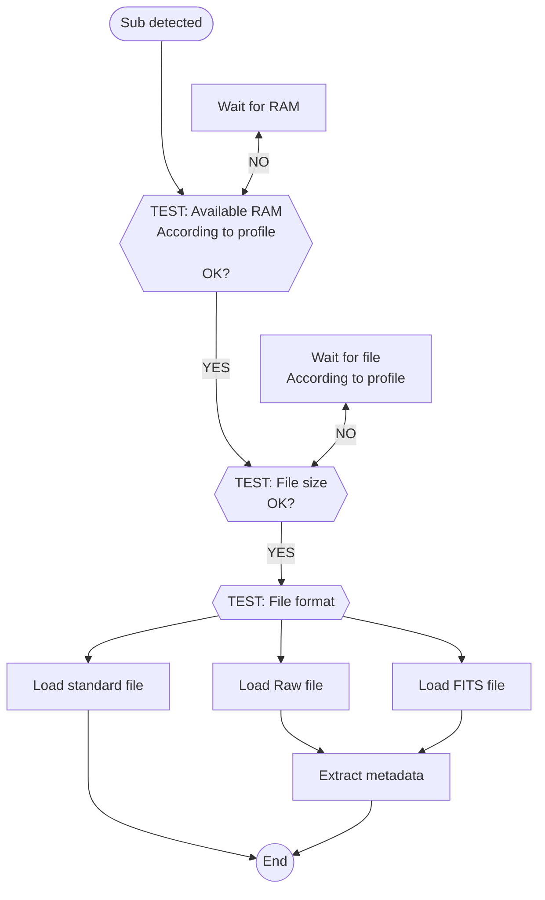

# Overview

The **Scanner** module is the entry point for your subs in ALS.

It is responsible for:
- Monitoring the appearance of subs in the **scan folder**
- Loading the detected subs

{}
ℹ️ **Existing files are ignored**

Files present in the **scan folder** before the **Scanner** module is started are not detected
{}

{}
ℹ️ **Detection of subs is recursive**

Subs are detected regardless of the level of subfolders where they appear within the **scan folder**

Even if they are saved in subfolders created after the **Scanner** module is started
{}

# Configuration

|                     | Source                                                                           | Data Type                        | Required | Default Value |
|---------------------|----------------------------------------------------------------------------------|----------------------------------|----------|---------------|
| **Scan Folder**     | Preferences: [General Tab](../../userguide/preferences/general/#scan-folder)     | Path to a folder                 | Yes      | ∅             |
| **Profile**         | Preferences: [General Tab](../../userguide/preferences/general/#profile)         | Choice:  - EAA - photo  | Yes      | EAA           |
| **Memory Use**      | Preferences: [General Tab](../../userguide/preferences/general/#memory)          | fuzzy                            | Yes      | "Unfair"      |
# Control

| Source                                                                       | Type        | Response                       |
|------------------------------------------------------------------------------|-------------|--------------------------------|
| Interface: [Session Controls](../../userguide/ui/controls/#session-controls) | Events      | Scan folder monitoring: ON/OFF |
| A sub has been detected in the scan folder                                   | Event       | Load the detected sub          |

# Input

| Data                     | Type              |
|--------------------------|-------------------|
| Path to the detected sub | File path         |

# Behavior

## RAM Test {#ram}

It may happen that subs are detected more frequently than ALS can process and save the images.

To avoid saturating the system memory by loading subs uncontrollably:

- Wait until the available RAM is greater than the value configured for memory management:

  | Memory Management | Amount of Memory Left for the System |
  |-------------------|--------------------------------------|
  | Greedy            | 256MiB                               |
  | Unfair            | 512MiB                               |
  | Fair              | 1GiB                                 |
  | Cautious          | 2GiB                                 |

## Wait for Complete File {#wait}

Files are detected as soon as they **appear** in the **scan folder**.

To avoid loading incomplete files, the **Scanner** module waits until the file is completely written before loading it:

- Poll the size of the detected file in a loop
    - Verify that the file size is stable over 2 consecutive polls

The polling interval depends on the configured profile:

| Profile        | Polling Interval |
|----------------|------------------|
| EAA            | 10ms             |
| Astrophoto     | 500ms            |

## Image Loading {#load}

### Compatible Formats {#input-formats}

ALS determines the image format based on its file extension:

The file is loaded into memory using the format determined by its extension.

| Extension                                                        | Format |
|------------------------------------------------------------------|--------|
| 
.jpg .jpeg
         | JPEG   |
| .png                | PNG    |
| 
.tiff .tif
         | TIFF   |
| 
.fits .fit .fts
 | FITS   |
| All other extensions                                             | Raw    |

## Metadata Extraction

Supported for:
- **FITS**
- **Raw**

Metadata extracted from file and incorporated into the loaded image:
- **Exposure Time**
- **Bayer Matrix** (_for subs from a color sensor_)
    - FITS files: **BAYERPAT** header
    - Raw files: standard Exif header

# Output

The loaded image is broadcast to whoever listens.

⚙️ _ALS will pass the image to the **Preprocess** module for calibration_

---

[1] [List of cameras supported by the libRaw library](https://www.libraw.org/supported-cameras)