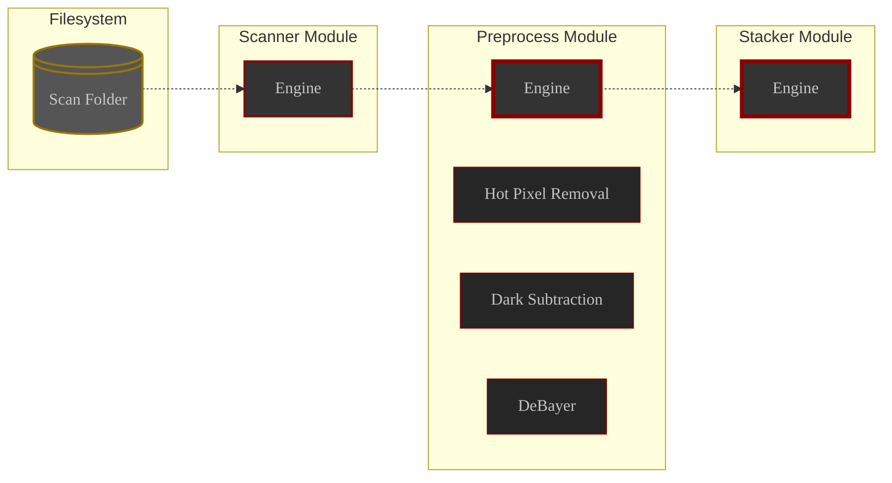
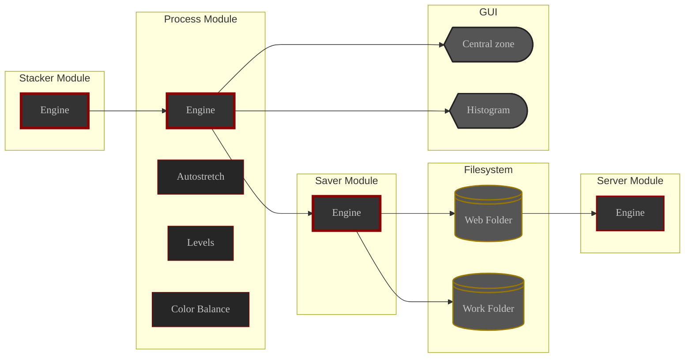

# Overview

This section contains detailed documentation about ALS bits and bolts

{}
🧠 It elaborates on the [concepts](/docs/v0.7/userguide/concepts) introduced at the beginning of the user guide

{}

# ALS Modules

ALS modules have their own engine and are responsible for a specific task.

## Main modules

Main modules are in charge of **image processing**

- start with ALS
- work endlessly on the content of **their own image queue**
  1. take the image at the head of the queue
  2. process it
  3. broadcast the result

    -  ⚙️ a hidden entity is responsible for listening to these broadcasts and sending the images to the right place: other queues, displays, etc...

  4. go back to step as soon as the queue is not empty

## Utility modules

Utility modules are responsible for auxiliary tasks

They don't have an input queue and can be started and stopped at will

ALS has two **utility modules**:
- the **Scanner** module
- the **Server** module

## Pipelines

A **pipeline** is a special **main module** that **splits its work** into a series of tasks called **processes**.

The pipeline is responsible for hosting its processes

The only duty of a **pipeline** on **each image** it picks up from its queue is :
- make sure it is processed by each process in order
  - each process working on the result of the previous one
- broadcast the result of the last process

ALS has two **pipelines**:
- the **PreProcess** module
- the **Process** module

# Realms

As implied earlier, ALS is split into two realms:
- the **Subs realm**: where your subs are processed
- the **Images realm**: where ALS's images are displayed and saved

## Subs realm

From the file system to the **Stacker** module

Flow inside the subs realm

## Images realm

From the **Stacker** module to the displays and output filesystem

Flow inside the images realm
