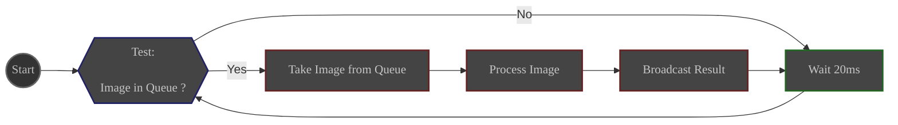
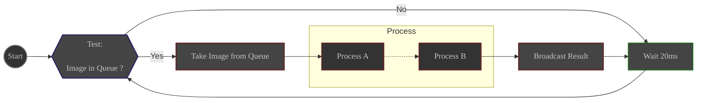

# Overview

In here, you will find detailed documentation about ALS modules and processes.

From what a module is to how a process works, you will find everything you need to know about the bits and bolts of ALS.

# Modules

An ALS module is an elaborated processing unit responsible for a specific task.

- It has its own engine
- It can be started and stopped at will
- It has access to the settings defined in ALS preferences
- Its behavior can be controlled through the ALS interface

Modules are **dumb and isolated**. They have no knowledge of other parts of the application. They just do their job 
and report to the application

## Utility module

A utility module is a very simple module that is in charge of auxiliary tasks inside ALS.

ALS uses 2 utility modules:
- **Scanner**
- **Server**

## Main module

A main module is a specialized module that is in charge of **image processing**.

- It has its own image input queue 
- It processes every image it takes from the queue, then broadcast the result to the application.

A main module is started with ALS and keeps polling its queue for new images to process, until the application is closed.

Main module workflow

ALS has 4 main modules:
- **Preprocess**
- **Stacker**
- **Process**
- **Save**

## Pipeline

A pipeline is a specialized main module that splits its work by handing its image over to a series of simple tasks called
processes.

It manages the list of processes to run on the images in its queue and the order in which they are executed.

It ensures that each process is executed in order, with each process working on the result of the previous one.

Once the last process is done, the pipeline broadcasts the result to the application.

Pipeline workflow

2 of the main modules are pipelines:

- **Preprocess**
- **Process**

# Process

A process is the smallest processing unit in ALS

It is managed by its parent pipeline and is responsible for a specific task to perform on a given image.

- It has access to the settings defined in ALS preferences
- It is controlled by its parent pipeline
- If the given image is empty, the process will return an empty image.
- If the process is disabled in prefs, the process will simply return the given image, **unchanged**.
- If an error occurs during processing, the process will signal the issue to ALS and return an empty image.

# Realms

As implied earlier, ALS is split into two realms:
- the **Subs realm**: where your subs are processed
- the **Images realm**: where ALS's images are displayed and saved

Below is the detailed flow within each realm.

## Subs realm

From the file system to the **Stacker** module

```mermaid
flowchart LR

    subgraph Filesystem
        SCAN_FOLDER@{ shape: lin-cyl, label: "Scan Folder" }
    end
        
    subgraph Scanner Module 
        SCANNER_ENGINE[Engine]
    end
           
    subgraph Preprocess Module
        direction TB
        PREPROCESS_ENGINE[Engine]
        HOT_PIXEL[Hot Pixel Removal]
        DARK_SUB[Dark Subtraction]
        DEBAYER[DeBayer]
    end  

    subgraph Stacker Module
        direction TB
        STACK_ENGINE[Engine]
    end

    SCAN_FOLDER -.-> SCANNER_ENGINE
    SCANNER_ENGINE -.-> PREPROCESS_ENGINE
    PREPROCESS_ENGINE -.-> STACK_ENGINE
    
    classDef module fill:#333,stroke:darkred,stroke-width:2px
    classDef main_module fill:#333,stroke:darkred,stroke-width:4px,color:#c6c6c6,font-family:'Poppins',sans-serif
    classDef process fill:#262626,stroke:darkred,stroke-width:1px,color:#c3c3c3,font-family:'Poppins',sans-serif
    classDef folder fill:#555,stroke:#970,stroke-width:2px,color:#c6c6c6,font-family:'Poppins',sans-serif
    classDef display fill:#555,stroke:#222,stroke-width:2px,color:#c6c6c6,font-family:'Poppins',sans-serif
    
    class SCANNER_ENGINE module
    class PREPROCESS_ENGINE main_module
    class STACK_ENGINE main_module
    class HOT_PIXEL process
    class DARK_SUB process
    class DEBAYER process
    class SCAN_FOLDER folder
```

Flow inside the subs realm

## Images realm

From the **Stacker** module to the displays and output filesystem

```mermaid
flowchart LR

    subgraph Stacker Module
        direction TB
        STACK_ENGINE[Engine]
    end
    
    subgraph Process Module
        direction TB
        PROCESS_ENGINE[Engine]
        STRETCH[Autostretch]
        LEVELS[Levels]
        COLOR_BAL[Color Balance]
    end 
    
    subgraph Save Module
        direction TB
        SAVE_ENGINE[Engine]
    end

    subgraph Filesystem
        direction TB
        
        WEB_FOLDER@{ shape: lin-cyl, label: "Web Folder" }
        WORK_FOLDER@{ shape: lin-cyl, label: "Work Folder" }
    end
    
    subgraph Server Module
        direction TB
        SERVER_ENGINE[Engine]
    end
    
    subgraph GUI
        direction TB
        SCREEN@{ shape: curv-trap, label: "Central zone" }
        HISTOGRAM@{ shape: curv-trap, label: "Histogram" }
    end
    
    STACK_ENGINE --> PROCESS_ENGINE
    
    PROCESS_ENGINE --> SAVE_ENGINE
    PROCESS_ENGINE ---> SCREEN
    PROCESS_ENGINE ---> HISTOGRAM
    
    SAVE_ENGINE --> WEB_FOLDER
    SAVE_ENGINE --> WORK_FOLDER

    WEB_FOLDER --> SERVER_ENGINE
    
    classDef module fill:#333,stroke:darkred,stroke-width:2px
    classDef main_module fill:#333,stroke:darkred,stroke-width:4px,color:#c6c6c6,font-family:'Poppins',sans-serif
    classDef process fill:#262626,stroke:darkred,stroke-width:1px,color:#c3c3c3,font-family:'Poppins',sans-serif
    classDef folder fill:#555,stroke:#970,stroke-width:2px,color:#c6c6c6,font-family:'Poppins',sans-serif
    classDef display fill:#555,stroke:#222,stroke-width:2px,color:#c6c6c6,font-family:'Poppins',sans-serif
    
    class STACK_ENGINE main_module
    class PROCESS_ENGINE main_module
    class SAVE_ENGINE main_module
    class SERVER_ENGINE module
    class SCREEN display
    class HISTOGRAM display
    class STRETCH process
    class LEVELS process
    class COLOR_BAL process
    class WEB_FOLDER folder
    class WORK_FOLDER folder
```

Flow inside the images realm
