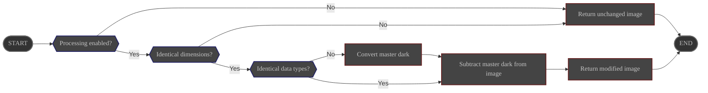

# Overview

The **DarkRemove** process subtracts the thermal noise from the image using a user-provided master dark.

Its configuration is managed via ALS preferences page.

# Configuration

|                  | Source                                                                                | Data type | Required  | Default value  |
|------------------|---------------------------------------------------------------------------------------|-----------|-----------|----------------|
| ON/OFF           | Preferences: [Processing Tab](../../../userguide/preferences/processing/#dark-remove) | ON/OFF    | ∅         | OFF            |
| Master dark path | Preferences: [Processing Tab](../../../userguide/preferences/processing/#dark-remove) | File path | Yes       | ∅              |

# Control

This process is triggered by the **Preprocess** pipeline.

# Input

| Data                                            | Type  |
|-------------------------------------------------|-------|
| image received from the **Preprocess** pipeline | Image |
| master dark read from configured path           | Image |

# Behavior

The master dark is subtracted from the image.

- If data types are different, the master dark is converted to the same data type as the image before subtraction.
- If dimensions are different, the process is aborted and the **unmodified** image is sent back to the **Preprocess** module.

# Output

The modified image is sent back to the **Preprocess** pipeline.