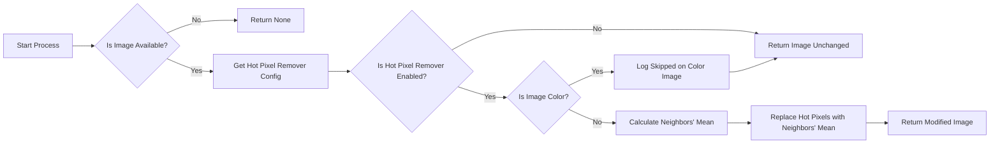

# Overview

The **HotPixelRemove** process removes hot pixels from the image.

Its configuration is managed via ALS preferences.

# Configuration

|        | Source                                                                                | Data Type | Required | Default   |
|--------|---------------------------------------------------------------------------------------|-----------|----------|-----------|
| ON/OFF | Preferences: [Processing Tab](../../../userguide/preferences/processing/#hot-remove)  | ON/OFF    | ∅        | OFF       |

# Control

This process is triggered by the **Preprocess** module.

# Input

| Data                                        | Type  |
|---------------------------------------------|-------|
| image provided by the **Preprocess** module | Image |

# Behavior

Each pixel in the image whose value deviates too much from its neighbors is considered a hot pixel.

Its value is replaced by the average value of its neighbors.

# Output

The modified image is sent back to the **Preprocess** module.