# Introduction

By the end of this chapter, you will know how ALS handles detected subs and what a session really is.

# Modules

ALS is architected in autonomous modules, divided into two families:

- **Main modules**

    Responsible for image processing:
    - **Preprocess**: Calibration
    - **Stack**: Alignment and stacking
    - **Process**: Visual processing
    - **Save**: Disk saving

- **Utility modules**

    Rresponsible for auxiliary tasks :
    - **Scanner**: monitoring the **scan folder**
    - **Server**: sharing images on the network

## Image Path

Images pass through ALS from the scan folder, up to display and disk saving.

```mermaid
graph LR

        B(Preprocess) -.-> C(Stack)
        C ---> D(Process)
        D --> E(Save)


    S(Scan Folder) -.-> A(Scanner)        
    A -.-> B
    E --> F(Work Folder)
    E --> G(Web Folder)
    G --> H(Server)
    D ---> I(Display)


    style A fill:#333,stroke:darkred,stroke-width:2px
    style B fill:#333,stroke:darkred,stroke-width:4px,color:#c6c6c6,font-family:'Poppins',sans-serif
    style C fill:#333,stroke:darkred,stroke-width:4px,color:#c6c6c6,font-family:'Poppins',sans-serif
    style D fill:#333,stroke:darkred,stroke-width:4px,color:#c6c6c6,font-family:'Poppins',sans-serif
    style E fill:#333,stroke:darkred,stroke-width:4px,color:#c6c6c6,font-family:'Poppins',sans-serif

    style F fill:#555,stroke:#970,stroke-width:2px,color:#c6c6c6,font-family:'Poppins',sans-serif
    style G fill:#555,stroke:#970,stroke-width:2px,color:#c6c6c6,font-family:'Poppins',sans-serif
    style S fill:#555,stroke:#970,stroke-width:2px,color:#c6c6c6,font-family:'Poppins',sans-serif
    
    style I fill:#555,stroke:#222,stroke-width:2px,color:#c6c6c6,font-family:'Poppins',sans-serif

    style H fill:#333,stroke:darkred,stroke-width:2px
```

Image path in ALS

- Your subs transit from the scan folder to the **Stack** module
- Images generated by ALS transit from the **Stack** module to the outputs

## Main Modules

These modules group and order image processing tasks 

Each module has its own queue and continuously performs the following actions:

1. Waits for a new image to appear in the queue
2. Processes the image
3. Transmits the processing result to the next module

In case of an error during image processing:

1. The image processing is aborted and the image is not transmitted to the next module.
2. The skipping of the image is signaled in the application.
3. The module resumes listening to its queue

### Preprocess {#preprocess-module}

{}
ℹ️ As soon as a new sub is detected by the **Scanner**, it is loaded and added to this module's queue.
{}

The **preprocess** module groups the following **calibration** processes:

1. **Hot pixel removal**

   Replaces the value of hot pixels with the average value of neighboring pixels.

2. **Dark subtraction**

   Uses a master dark provided by you to subtract thermal noise from the image.

3. **Debayering**

   **Color** images in **FITS** or **Raw** format are converted to RGB color using the Bayer matrix described in the
   file headers.

You can find more information about the **Preprocess** module in its [detailed documentation](../../modules/preprocess/).

### Stack {#stack-module}

The **Stack** module maintains the **current stack** and handles the following processes:

1. **Alignment**: Aligns the image to the session reference
2. **Stacking**
    - Adds the image to the current stack
    - Generates the stacking result based on the mode chosen by the user (_mean or sum_) and sends it to the **Process**
      module

{}
ℹ️ Alignment is based on the search for star groups in the compared images. ALS can only align deep sky images. **Planet
or Moon images cannot be aligned**.
{}

You can find more information about the **Stack** module in its [detailed documentation](../../modules/stack/).

### Process {#process-module}

The **Process** module groups the visual processing applied to the stacking result:

1. **Auto stretch**

   Automatically adjusts the image levels for optimal viewing

2. **Levels**

   Allows adjusting the black and white clipping, and the mid-tone level

3. **RGB balance**

   Allows adjusting the color balance

{}
ℹ️ The image displayed in ALS's **central area** is replaced by each image output from the **Process** module
{}

### Save {#save-module}

The **Save** module is in charge of saving to disk every image processing result received from the **Process** module.

The **Save** module saves images in two target folders:
- The **work folder** for processing results
- The **web folder** for images shared over the network, served by the **Server** module

Each processing result is saved in 2 files:

1. Main output:
    - **Location**: work folder
    - **Name**: stack_image
    - **Format**: As defined in [Preferences](../preferences/output/#format). ℹ️ Default: JPEG

2. Server output:
    - **Location**: web folder
    - **Name**: web_image
    - **Format**: JPEG

{}
⚠️ These 2 files are overwritten by every successive processing result.
{}

{}
ℹ️ By default, the path of the **web folder** is the same as that of the **work folder**.

You can define a specific **web folder** in the [Preferences](../preferences/output/#web-folder).
{}

You can find more information about the **Save** module in its [detailed documentation](../../modules/save/).

## Utility Modules

ALS uses other modules that are not involved in image processing. However, they are essential for the proper functioning
of the application:

### Scanner

This module is responsible for detecting new subs in the **scan folder** and transmitting them to the
**Preprocess** module.

You can find more information about the **Scanner** module in its [detailed documentation](../../modules/scanner/).

### Server

This module handles sharing the **server output** of the **Save** module over the network.

It is accessible from the network to which the machine running ALS is connected.

The image displayed on the served web page is periodically refreshed by browsers.

{}
ℹ️ When the server is started, its address is displayed in the application and a QR code can be displayed on demand.
{}

---

# The Session {#session}

Within ALS, the session occupies a prominent place.

**The session** can be seen as the materialization of the lifecycle of the pair formed by the **current stack** and the
**scanner**.

1. **Start**:
    - ALS starts the **scanner** and clears the **current stack**.
    - **First Detection**: The first sub received by the **Stack** module will serve as **alignment reference**
      throughout the session.

2. **Running**:
    - each new detected sub is in turn:
        - calibrated
        - aligned to the reference image
        - added to current stack
    - The successive results of this stacking are processed then displayed by the application and saved to disk.

   The session can be paused: ALS stops the **scanner** and the **current stack** is **preserved**.
   Restarting the session simply restarts the **scanner**.

   At any time, the user can navigate the displayed image, zoom, adjust processing parameters...

3. **Stop**:
    - When the session stops, the **scanner** is stopped and the **current stack** is marked to be cleared at the
      next session start.

{}
ℹ️ ALS does not process images already present in the **scanned folder** when a session starts
{}

# Conclusion

You now have a clear understanding of the architecture and basic concepts of ALS.

Next step: the ALS graphical interface.
