# Introduction

By the end of this chapter, the basic concepts of ALS will be familiar to you.

You will understand what ALS does and how it does it.

# Stacking {#stacking}

Stacking is the process of combining multiple subs of the same target to generate a more detailed and contrasted image than a single sub.

The quality of the result increases as more subs are used.





# The stack {#stack}

The **stack** is the set of subs on which ALS performs real-time stacking (livestacking).

# Livestacking with ALS

ALS monitors the destination folder of your image acquisition system.

When a new sub is detected, it is added to the **stack** and a new stacking result is generated.

# ALS modules {#modules}

ALS is architected into autonomous modules, divided into two families:

- **Main modules**

  Responsible for image processing:
    - **Preprocess**: Calibration
    - **Stacker**: Alignment and stacking
    - **Process**: Visual processing
    - **Save**: Disk saving

- **Utility modules**

  Responsible for auxiliary tasks:
    - **Scanner**: Monitoring the **scan folder**
    - **Server**: Sharing images over the network

## Image path {#image-path}

Images pass through ALS, module after module, from the scan folder, up to display and disk saving.

```mermaid
graph LR

        B(Preprocess) -.-> C(Stacker)
        C ---> D(Process)
        D --> E(Save)


    S(Scan Folder) -.-> A(Scanner)        
    A -.-> B
    E --> F(Work Folder)
    E --> G(Web Folder)
    G ---> H(Server)
    D ---> I(Display)


    style A fill:#333,stroke:darkred,stroke-width:2px
    style B fill:#333,stroke:darkred,stroke-width:4px,color:#c6c6c6,font-family:'Poppins',sans-serif
    style C fill:#333,stroke:darkred,stroke-width:4px,color:#c6c6c6,font-family:'Poppins',sans-serif
    style D fill:#333,stroke:darkred,stroke-width:4px,color:#c6c6c6,font-family:'Poppins',sans-serif
    style E fill:#333,stroke:darkred,stroke-width:4px,color:#c6c6c6,font-family:'Poppins',sans-serif

    style F fill:#555,stroke:#970,stroke-width:2px,color:#c6c6c6,font-family:'Poppins',sans-serif
    style G fill:#555,stroke:#970,stroke-width:2px,color:#c6c6c6,font-family:'Poppins',sans-serif
    style S fill:#555,stroke:#970,stroke-width:2px,color:#c6c6c6,font-family:'Poppins',sans-serif
    
    style I fill:#555,stroke:#222,stroke-width:2px,color:#c6c6c6,font-family:'Poppins',sans-serif

    style H fill:#333,stroke:darkred,stroke-width:2px
```

Image path in ALS

- Your subs transit from the scan folder to the **Stacker** module.
- Images generated by ALS transit from the **Stacker** module to the outputs.

## Main Modules

These modules group and order image processing tasks.

Each module has its own queue and continuously performs the following actions:

1. Waits for a new image to appear in the queue.
2. Processes the image.
3. Transmits the processing result to the next module.

In case of an error during image processing:

1. The image processing is aborted and the image is not transmitted to the next module.
2. The skipping of the image is signaled in the application.
3. The module resumes listening to its queue.

### Preprocess {#preprocess-module}

{}
ℹ️ As soon as a new sub is detected by the **Scanner**, it is loaded and added to this module's queue.
{}

The **preprocess** module groups the following **calibration** processes:

1. **Hot pixel removal**

   Replaces the value of hot pixels with the average value of neighboring pixels.

2. **Dark subtraction**

   Uses a master dark provided by you to subtract thermal noise from the image.

3. **Debayering**

   **Color** images in **FITS** or **Raw** format are converted to RGB color using the Bayer pattern described in the file headers.

You can find more information about the **Preprocess** module in its [detailed documentation](../../modules/preprocess/).

### Stacker {#stack-module}

The **Stacker** module maintains the **stack** and processes each calibrated sub:

1. **Alignment**: 

   Aligns the sub to the session reference.

2. **Stacking**:
    - Adds the sub to the current stack.
    - Generates the stacking result based on the mode chosen by the user (_mean or sum_)

{}
ℹ️ Alignment is based on the search for star groups in the compared images. ALS can only align deep sky images. **Planet or Moon images cannot be aligned**.
{}

You can find more information about the **Stacker** module in its [detailed documentation](../../modules/stack/).

### Process {#process-module}

The **Process** module groups the visual processing applied to the stacking results:

1. **Auto stretch**

   Automatically adjusts the image levels for optimal viewing.

2. **Levels**

   Allows adjusting the black and white clipping, and the mid-tone level.

3. **RGB balance**

   Allows adjusting the color balance.

{}
ℹ️ The image displayed in ALS's **central area** is replaced by each image output from the **Process** module.
{}

### Save {#save-module}

The **Save** module is in charge of saving to disk every processing result

The **Save** module saves images in two target folders:
- The **work folder** for storing processing results
- The **web folder** for sharing on the network via the **Server** module.

Each processing result is saved in 2 files:

1. Main output:
    - **Location**: work folder.
    - **Name**: stack_image.
    - **Format**: As defined in [Preferences](../preferences/output/#format). ℹ️ Default: JPEG.

2. Server output:
    - **Location**: web folder.
    - **Name**: web_image.
    - **Format**: JPEG.

{}
⚠️ These 2 files are overwritten by every successive processing result.
{}

{}
ℹ️ By default, the path of the **web folder** is the same as that of the **work folder**.

You can define a specific **web folder** in the [Preferences](../preferences/output/#web-folder).
{}

You can find more information about the **Save** module in its [detailed documentation](../../modules/save/).

## Utility Modules

ALS uses other modules that are not involved in image processing. However, they are essential for the proper functioning of the application:

### Scanner

This module is responsible for detecting new subs in the **scan folder** and transmitting them to the **Preprocess** module.

You can find more information about the **Scanner** module in its [detailed documentation](../../modules/scanner/).

### Server

This module handles sharing the **server output** of the **Save** module over the network.

It is accessible from the network to which the machine running ALS is connected.

The image displayed on the served web page is periodically refreshed by browsers.

{}
ℹ️ When the server is started, its address is displayed in the application and a QR code can be displayed on demand.
{}

---

# The session {#session}

A **session** can be seen as the lifecycle of the pair formed by the **stack** and the **Scanner**.

1. **Session start**:
    - ALS clears the **stack** and starts the **Scanner**.

2. **Progress**:
    - Subs are loaded and flow through the application.
    - The first sub received by the **Stacker** module will serve as **alignment reference** throughout the session.
    - The session can be **paused**: ALS stops the **Scanner** and retains the **stack**.

      Resuming the session starts the **Scanner**. The next subs will be added to the current **stack**.

   At any time, the user can navigate the displayed image, zoom, adjust processing parameters...

3. **Session end**:
    - the **Scanner** is stopped.
    - the **Stacker** module will clear the **stack** at the next session start.

{}
ℹ️ ALS does not process images already present in the **scan folder** when a session starts.
{}

# Conclusion

You now have a clear understanding of the architecture and basic concepts of ALS.

Next step: the ALS graphical interface.