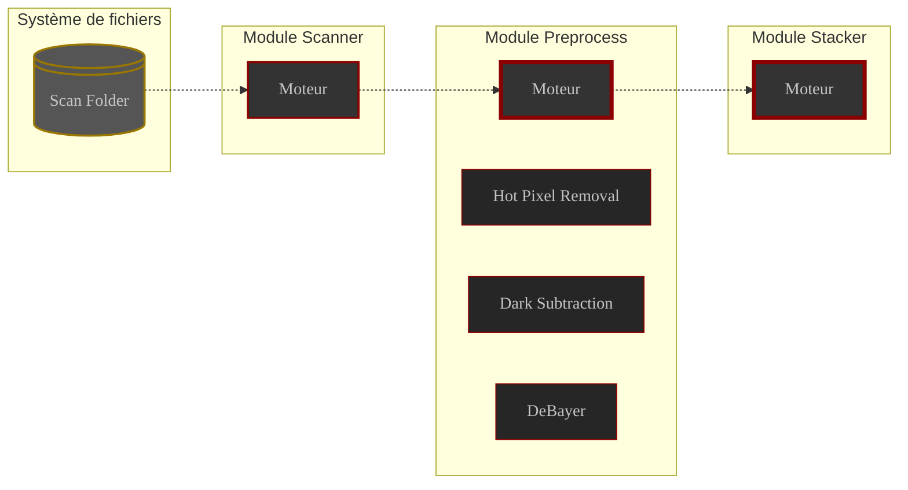
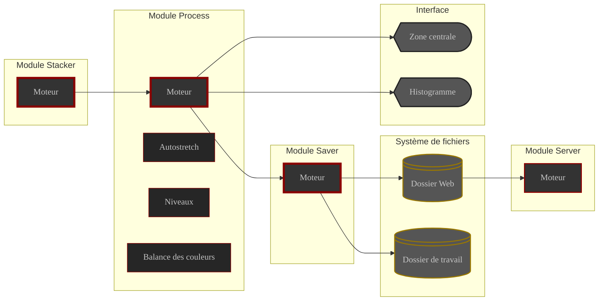

# Vue d'ensemble

Cette section contient une documentation détaillée sur les rouages d'ALS

{}
🧠 Elle développe les [concepts](/docs/v0.7/userguide/concepts) introduits au début du guide de l'utilisateur

{}

# Modules ALS

Les modules ALS ont leur propre moteur et sont responsables d'une tâche spécifique.

## Modules principaux

Les modules principaux sont en charge du **traitement des images**

- démarrent avec l'ALS
- travaillent sans fin sur le contenu de **leur propre file d'attente d'images**
  1. prendre l'image en tête de la file d'attente
  2. la traiter
  3. diffuser le résultat

    -  ⚙️ une entité cachée se charge d'écouter ces diffusions et d'envoyer les images au bon endroit : d'autres 
       files d'attente, des affichages, etc...

  4. reprendre à l'étape 1 dès que file d'attente n'est pas vide

ALS a quatre **modules principaux** :
- le module **Preprocess**
- le module **Stacker**
- le module **Process**
- le module **Save**

## Modules utilitaires

Les modules utilitaires sont responsables des tâches auxiliaires

Ils n'ont pas de file d'attente d'entrée et peuvent être démarrés et arrêtés à volonté

ALS a deux **modules utilitaires** :
- le module **Scanner**
- le module **Server**

## Pipelines

Un **pipeline** est un **module principal** spécial qui **divise son travail** en une série de tâches appelées **traitements**.

Le pipeline est responsable de l'hébergement de ses traitements

La seule tâche d'un **pipeline** sur **chaque image** qu'il prend dans sa file d'attente est :
  - s'assurer qu'elle est traitée par chaque traitement dans l'ordre
    - chaque traitement travaillant sur le résultat du précédent
  - diffuser le résultat du dernier traitement

ALS a deux **pipelines** :
- le module **Preprocess**
- le module **Process**

# Domaines

Comme indiqué précédemment, ALS est divisé en deux domaines :
- le **domaine des Brutes** : où vos brutes sont traitéés
- le **domaine des Images** : où les images d'ALS sont affichées et sauvegardées

## Domaine des Brutes

Du système de fichiers au module **Stacker**

Flux à l'intérieur du domaine des subs

## Domaine des Images

Du module **Stacker** aux affichages et au système de fichiers de sortie

Flux à l'intérieur du domaine des images
