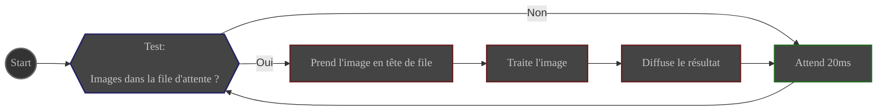
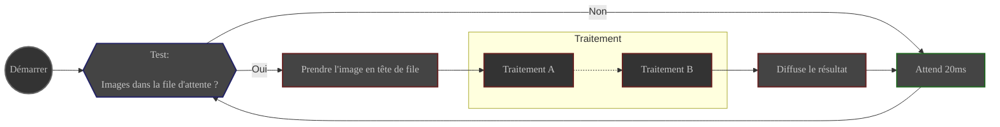

# Vue d'ensemble

Ici, vous trouverez une documentation détaillée sur les modules et traitements d'ALS.

De ce qu'est un module à la façon dont fonctionne un traitement, vous trouverez tout ce que vous devez savoir sur 
les rouages d'ALS.

# modules

Un module ALS est une unité de traitement élaborée responsable d'une tâche spécifique.

- Il a son propre moteur
- Il peut être démarré et arrêté à volonté
- Il a accès aux paramètres définis dans les préférences ALS
- Son comportement peut être contrôlé via l'interface ALS

Les modules sont **simples et isolés**. Ils n'ont aucune connaissance des autres parties de l'application. Ils 
font simplement leur travail et rendent compte à l'application.

## Modules utilitaires

Un module utilitaire est un module très simple qui est chargé d'une unique tâche auxiliaire à l'intérieur d'ALS.

ALS utilise 2 modules utilitaires :
- **Scanner**
- **Server**

## Module principal

Un module principal est un module spécialisé qui est chargé de **traitements d'images**.

- Il a sa propre file d'attente d'images en entrée
- Il traite chaque image qu'il prend de la file d'attente, puis diffuse le résultat à l'application.

Un module principal est démarré avec ALS et continue de sonder sa file d'attente pour de nouvelles images à traiter,
jusqu'à ce que l'application soit fermée.

Flux de travail du module principal

ALS a 4 modules principaux :
- **Preprocess**
- **Stack**
- **Process**
- **Save**

## pipelines

Un pipeline est un module principal spécialisé qui divise son travail en soumettant son image à une série de tâches 
simples appelées traitement.

Il gère la liste des traitements à exécuter sur les images de sa file d'attente et l'ordre dans lequel ils sont exécutés.

Il s'assure que chaque traitement est exécuté dans l'ordre, chaque traitement travaillant sur le résultat du précédent.

Une fois le dernier traitement terminé, le pipeline diffuse le résultat à l'application.

Flux de travail du pipeline

2 des modules principaux sont des pipelines :

- **Preprocess**
- **Process**

# traitement

Un traitement est la plus petite unité de traitement dans ALS

Il est géré par son pipeline parent et est responsable d'une tâche spécifique à effectuer sur une image donnée.

- Il a accès aux paramètres définis dans les préférences ALS
- Il est contrôlé par son pipeline parent
- Si l'image donnée est vide, le traitement renverra une image vide.
- Si le traitement est désactivé dans les préférences, le traitement renverra simplement l'image donnée, **inchangée**.
- Si une erreur se produit pendant son travail sur l'image, le traitement signalera le problème à ALS et renverra 
  une image vide.
