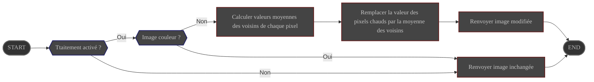

# Présentation

Le Traitement **HotPixelRemove** supprime les pixels chauds de l'image

Sa configuration est gérée via les préférences

# Configuration

|        | Source                                                                                   | Type de donnée | Requis | Valeur par défaut |
|--------|------------------------------------------------------------------------------------------|----------------|--------|-------------------|
| ON/OFF | Préférences : [Onglet Traitement](../../../userguide/preferences/processing/#hot-remove) | ON/OFF         | ∅      | OFF               |

# Contrôle

Ce traitement est contrôlé par le pipeline **Preprocess**

# Entrée

| Donnée                                       | Type  |
|----------------------------------------------|-------|
| image fournie par le pipeline **Preprocess** | Image |

# Comportement

Chaque pixel de l'image dont la valeur s'écarte trop de ses voisins est considéré comme un pixel chaud 

Sa valeur est remplacée par la valeur moyenne de ses voisins.

# Sortie

L'image modifiée est renvoyée au pipeline **Preprocess**
