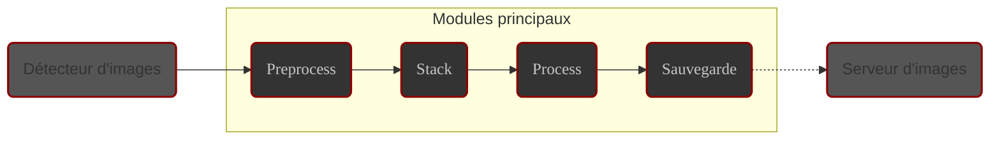

# Introduction

À la fin de ce chapitre, le fonctionnement global d'ALS et la notion de session n'auront plus de secret pour vous.

# Modules

ALS est architecturé en modules autonomes, répartis en deux familles :

- **Modules principaux** : en charge des tâches de traitement d'image
    - **Preprocess** : Calibration
    - **Stack** : Alignement et empilement
    - **Process** : Traitements visuels
    - **Sauvegarde** : Enregistrement sur disque

- **Modules utilitaires** : en charge des tâches annexes
    - **Détecteur d'images** : surveillance du **dossier scanné**
    - **Serveur d'images** : partage des images générées par ALS

## Trajet d'une image

Chaque image détectée passe de module en module, dans l'ordre suivant :

Trajet d'une image dans ALS

## Modules principaux

Ces modules regroupent et ordonnent les traitements à appliquer aux images à mesure de leur cheminement dans la chaîne
de traitement.

Chaque module possède sa file d'attente et exécute en boucle les actions suivantes :

1. Attend qu'une nouvelle image se présente en file d'attente
2. Traite l'image
3. Transmet le résultat du traitement au module suivant

En cas d'erreur pendant le traitement d'une image :

1. Le traitement de l'image est abandonné et l'image n'est pas transmise au module suivant.
2. L'abandon de l'image est signalé discrètement dans l'application.
3. Le module se remet à l'écoute de sa file d'attente

### Preprocess {#preprocess-module}

{}
ℹ️ Dès qu'une nouvelle brute est détectée, elle est ajoutée à la file d'attente de ce module.
{}

Le module **preprocess** regroupe les traitements de calibration suivants :

1. **Suppression des pixels chauds**

   Remplace la valeur des pixels chauds par la valeur moyenne des pixels voisins.

2. **Soustraction de master dark**

   Utilise un master dark fourni par l'utilisateur pour soustraire le bruit thermique de l'image.

3. **Dématriçage**

   Les images **couleur** au format **FITS** ou **Raw** sont converties en couleur RVB en utilisant la matrice de Bayer
   décrite dans les entêtes du fichier.

Vous trouverez plus d'information sur le module **Preprocess** dans sa [documentation détaillée](../modules/preprocess/) 

### Stack {#stack-module}

Le module **Stack** maintient la **stack courante** et prend en charge les traitements suivants :

1. **Alignement** : Aligne l'image sur la référence de la session
2. **Empilement**
    - Ajoute l'image à la stack courante
    - Génère le résultat de l'empilement en fonction du mode choisi par l'utilisateur (_moyenne ou somme_) et l'envoie
      au module **Process**

{}
ℹ️ L'alignement est basé sur la recherche de groupes d'étoiles dans les images comparées. ALS ne peut donc aligner que
des images du ciel profond. **Les images de planètes ou de la Lune ne peuvent pas être alignées**.
{}

Vous trouverez plus d'information sur le module **Stack** dans sa [documentation détaillée](../modules/stack/) 

### Process {#process-module}

Le module **Process** regroupe les traitements visuels appliqués sur le résultat de l'empilement :

1. **Auto stretch**

   Ajuste automatiquement les niveaux de l'image pour une visualisation optimale

2. **Niveaux**

   Permet de régler l'écrêtage des noirs et des blancs, et le niveau des tons moyens de l'image

3. **Balance RVB**

   Permet de régler la balance des couleurs de l'image

{}
ℹ️ L'image affichée dans la **zone centrale** d'ALS est remplacée par chaque image se présentant en sortie du module
**Process**.
{}

### Sauvegarde {#save-module}

Le module **Sauvegrde** est en charge de l'enregistrement sur disque des images traitées.

Chaque image est enregistrée dans 2 fichiers :

1. Sortie principale :

    - **emplacement du fichier** : **dossier de travail**
    - **nom du fichier** : stack_image
    - **Format et extension du fichier** : Tel que défini dans les [Préférences](../preferences/output/#format).

      Par défaut : format **JPEG**, extension **.jpg**.

2. Sortie serveur :

    - **emplacement du fichier** : **dossier de travail**
    - **nom du fichier** : web_image
    - **Format et extension du fichier** : format **JPEG**, extension **.jpg**.

{}
⚠️ Ces 2 fichiers sont écrasés par chaque nouvelle image traitée
{}

## Modules utilitaires

ALS utilise d'autres modules qui ne sont pas impliqués dans le traitement des images. Ils sont cependant essentiels au
bon fonctionnement de l'application :

### Détecteur d'images

Ce module est en charge de détecter les nouvelles images dans le **dossier scanné** et de les transmettre au
module **Preprocess**.

Vous trouverez plus d'information sur le module **détecteur d'images** dans 
sa [documentation détaillée](../modules/detector/)

### Serveur d'image

Ce module prend en charge le partage sur le réseau de la **sortie web** du module **Enregistreur d'images**.

Il est accessible depuis le réseau auquel la machine qui exécute ALS est connectée.

L'image affichée dans la page web servie est rafraîchie périodiquement par les navigateurs.

{}
ℹ️ Quand le serveur est démarré, son adresse est affichée dans l'application et un QR code peut être affiché à la
demande.
{}

---

# La session {#session}

Au sain d'ALS, la session occupe une place prépondérante.

**La session** peut être vue comme la matérialisation du cycle de vie du couple formé par la **stack courante**
et le **détecteur d'images**.

1. **Démarrage** :
    - ALS démarre le **détecteur d'images** et vide **la stack courante**.
    - **Première Détection** : La première image reçue par le module **Stack** servira de **référence pour
      l'alignement** durant toute la session.

2. **Déroulement** :
    - chaque nouvelle image détectée est successivement
        - pré-traitée
        - alignée sur l'image de référence
        - empilée dans la stack courante.
    - Les résultats successifs de cet empilement sont traités puis affichés par l'application et enregistrés sur disque.

   La session peut être mise en pause : ALS stoppe le **détecteur d'images** et la **stack courante** est **conservée**.
   Relancer la session redémarre simplement le **détecteur d'images**

   À tout moment, l'utilisateur peut naviguer dans l'image affichée, zoomer, régler les paramètres de traitement...

3. **Arrêt** :
    - À l'arrêt de la session, le **détecteur d'images** est stoppé et la **stack courante** est marquée pour être
      vidée au prochain démarrage de session.

{}
ℹ️ ALS ne traite pas les images déjà présentes dans le **dossier scanné** quand une session démarre
{}

# Conclusion

Vous avez maintenant une vision claire de l'architecture et des concepts de base d'ALS.

Prochaine étape : l'interface graphique d'ALS.
