# Introduction

À la fin de ce chapitre, les concepts de base d'ALS vous seront familiers. 

Vous comprendrez ce que fait ALS et comment il le fait.

# Le stacking {#stacking}

Le stacking (🇫🇷 empilement) est le processus de combinaison de plusieurs brutes de la même cible pour générer une image
plus détaillée et contrastée qu'une unique brute.

La qualité du résultat augmente à mesure qu'on utilise un plus grand nombre de brutes.





# La stack {#stack}

La **stack** (🇫🇷 pile) est l'ensemble de brutes sur lequel ALS effectue du stacking en temps réel (🇬🇧 livestacking)

# Le Livestacking avec ALS

ALS surveille le dossier de destination de votre système d'acquisition d'images

Quand une nouvelle brute est détectée, elle est ajoutée à la **stack** et un nouvel empilement est généré.

# Les modules d'ALS {#modules}

ALS est architecturé en modules autonomes, répartis en deux familles :

- **Modules principaux**

  En charge des traitements d'image :
    - **Preprocess** : Calibration
    - **Stacker** : Alignement et empilement
    - **Process** : Traitements visuels
    - **Save** : Enregistrement sur disque

- **Modules utilitaires**

  En charge des tâches annexes :
    - **Scanner** : surveillance du **dossier scanné**
    - **Server** : partage des images sur le réseau

## Trajet des images {#image-path}

Les images traversent ALS en passant de module en module, depuis le dossier scanné jusqu'à l'affichage et 
l'enregistrement sur disque.

```mermaid
graph LR

        B(Preprocess) -.-> C(Stacker)
        C ---> D(Process)
        D --> E(Save)


    S(Dossier Scanné) -.-> A(Scanner)        
    A -.-> B
    E --> F(Dossier de Travail)
    E --> G(Dossier Web)
    G ---> H(Server) 
    D ---> I(Affichage)


    style A fill:#333,stroke:darkred,stroke-width:2px
    style B fill:#333,stroke:darkred,stroke-width:4px,color:#c6c6c6,font-family:'Poppins',sans-serif
    style C fill:#333,stroke:darkred,stroke-width:4px,color:#c6c6c6,font-family:'Poppins',sans-serif
    style D fill:#333,stroke:darkred,stroke-width:4px,color:#c6c6c6,font-family:'Poppins',sans-serif
    style E fill:#333,stroke:darkred,stroke-width:4px,color:#c6c6c6,font-family:'Poppins',sans-serif

    style F fill:#555,stroke:#970,stroke-width:2px,color:#c6c6c6,font-family:'Poppins',sans-serif
    style G fill:#555,stroke:#970,stroke-width:2px,color:#c6c6c6,font-family:'Poppins',sans-serif
    style S fill:#555,stroke:#970,stroke-width:2px,color:#c6c6c6,font-family:'Poppins',sans-serif
    
    style I fill:#555,stroke:#222,stroke-width:2px,color:#c6c6c6,font-family:'Poppins',sans-serif

    style H fill:#333,stroke:darkred,stroke-width:2px
```

Trajet des images dans ALS

- Vos brutes transitent du dossier scanné jusqu'au module **Stacker**
- Les images générées par ALS transitent du module **Stacker** jusqu'aux sorties 

## Modules principaux

Ces modules regroupent et ordonnent les traitements à appliquer aux images

Chaque module possède sa file d'attente et exécute en boucle les actions suivantes :

1. Attend qu'une nouvelle image se présente en file d'attente
2. Traite l'image
3. Transmet le résultat du traitement au module suivant

En cas d'erreur pendant le traitement d'une image :

1. Le traitement de l'image est abandonné et l'image n'est pas transmise au module suivant.
2. L'abandon de l'image est signalé dans l'application.
3. Le module se remet à l'écoute de sa file d'attente

### Preprocess {#preprocess-module}

{}
ℹ️ Dès que le **Scanner** détecte une nouvelle brute, elle est chargée et ajoutée à la file d'attente de ce module.
{}

Le module **preprocess** regroupe les traitements de **calibration** des brutes :

1. **Suppression des pixels chauds**

   Remplace la valeur des pixels chauds par la valeur moyenne des pixels voisins.

2. **Soustraction de dark**

   Utilise un master dark fourni par vous pour soustraire le bruit thermique.

3. **Dématriçage**

   Les brutes **couleur** au format **FITS** ou **Raw** sont converties en couleur RVB en utilisant la matrice de Bayer
   décrite dans les entêtes du fichier.

Vous trouverez plus d'information sur le module **Preprocess** dans sa [documentation détaillée](../../modules/preprocess/) 

### Stacker {#stack-module}

Le module **Stacker** maintient la **stack** et prend en charge les traitements des brutes calibrées :

1. **Alignement**

   Aligne la brute sur la référence de la session

2. **Empilement**
    - Ajoute la brute à la **stack**
    - Génère le résultat de l'empilement en fonction du mode choisi par vous (_moyenne ou somme_)

{}
ℹ️ L'alignement est basé sur la recherche de groupes d'étoiles dans les brutes comparées. ALS ne peut donc aligner que
des images du ciel profond. **Les images de planètes ou de la Lune ne peuvent pas être alignées**.
{}

Vous trouverez plus d'information sur le module **Stacker** dans sa [documentation détaillée](../../modules/stack/) 

### Process {#process-module}

Le module **Process** regroupe les traitements visuels appliqués sur les résultats d'empilement :

1. **Auto stretch**

   Ajuste automatiquement les niveaux de l'image pour une visualisation optimale

2. **Niveaux**

   Permet de régler l'écrêtage des noirs et des blancs, et le niveau des tons moyens de l'image

3. **Balance RVB**

   Permet de régler la balance des couleurs de l'image

{}
ℹ️ L'image affichée dans la **zone centrale** d'ALS est remplacée par chaque image se présentant en sortie du module
**Process**.
{}

### Save {#save-module}

Le module **Save** est en charge de l'enregistrement sur disque des résultats de traitement

Le module **Save** enregistre les images dans deux dossiers cibles :
- Le **dossier de travail** pour la conservation des résultats traités
- Le **dossier web** pour la diffusion sur le réseau par le module **Server**

Chaque résultat de traitement est enregistré dans 2 fichiers :

1. Sortie principale :
    - **Emplacement** : dossier de travail
    - **Nom** : stack_image (+ horodatage si demandé)
    - **Format** : Tel que défini dans les [Préférences](../preferences/output/#format). ℹ️ Par défaut : JPEG

2. Sortie serveur :
    - **Emplacement** : dossier web
    - **Nom** : web_image
    - **Format** : JPEG

{}
⚠️ Ces 2 fichiers sont écrasés par tous les résultats de traitement successifs.
{}

{}
ℹ️ Par défaut, le chemin du **dosser web** est identique à celui du **dossier de travail**.

Vous pouvez définir un **dossier web** spécifique dans les [Préférences](../preferences/output/#web-folder).
{}

Vous trouverez plus d'information sur le module **Save** dans sa [documentation détaillée](../../modules/save/) 

## Modules utilitaires

ALS utilise d'autres modules qui ne sont pas impliqués dans le traitement des images. Ils sont cependant essentiels au
bon fonctionnement de l'application :

### Scanner

Ce module est en charge de détecter les nouvelles brutes dans le **dossier scanné** et de les transmettre au
module **Preprocess**.

Vous trouverez plus d'information sur le module **Scanner** dans 
sa [documentation détaillée](../../modules/scanner/)

### Server

Ce module prend en charge le partage sur le réseau de la **sortie web** du module **Save**.

Il est accessible depuis le réseau auquel la machine qui exécute ALS est connectée.

L'image affichée dans la page web servie est rafraîchie périodiquement par les navigateurs.

{}
ℹ️ Quand le serveur est démarré, son adresse est affichée dans l'application et un QR code peut être affiché à la
demande.
{}

---

# La session {#session}

Une **session** peut être vue comme le cycle de vie du couple formé par la **stack** et le **Scanner**.

1. **Démarrage de la session** :
    - ALS vide la **stack** et démarre le **Scanner**.

2. **Déroulement** :
    - Les brutes sont chargées et suivent leur chemin dans l'application.
    - La première brute reçue par le module **Stacker** servira de **référence d'alignement** durant toute la session.
    - La session peut être mise en **pause** : ALS stoppe le **Scanner** et conserve la **stack**

      Relancer la session démarre le **Scanner**. Les prochaines brutes s'ajouteront à la **stack** en cours.

   À tout moment, l'utilisateur peut naviguer dans l'image affichée, zoomer, régler les paramètres de traitement...

3. **Arrêt de la session** :
    - le **Scanner** est stoppé
    - le module **Stacker** videra la **stack** au prochain démarrage de session

{}
ℹ️ ALS ne traite pas les images déjà présentes dans le **dossier scanné** quand une session démarre
{}

# Conclusion

Vous avez maintenant une vision claire de l'architecture et des concepts de base d'ALS.

Prochaine étape : l'interface graphique d'ALS.
