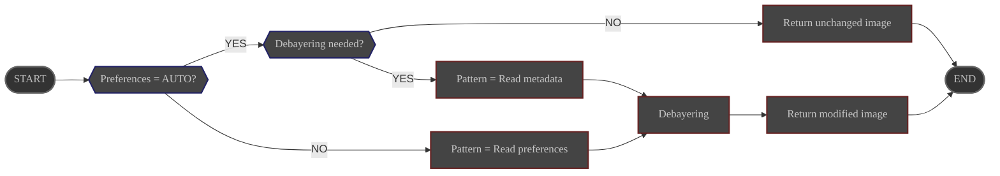

# Overview

The **Debayer** process is used on **color** images in **FITS** or **Raw** format.

It generates a color image from the raw image and the description of the Bayer pattern installed on the sensor that
generated the image.

Its configuration is managed via ALS preferences page.

# Configuration

|               | Source                                                                            | Data Type                                                  | Required | Default Value |
|---------------|-----------------------------------------------------------------------------------|------------------------------------------------------------|----------|---------------|
| Bayer pattern | Preferences: [Processing Tab](../../../userguide/preferences/processing/#debayer) | choice:  - AUTO - GRBG - RGGB - GBRG - BGGR | YES      | AUTO          |

# Control

This process is triggered by the **Preprocess** module.

# Input

| Data                                          | Type  |
|-----------------------------------------------|-------|
| image received from the **Preprocess** module | Image |

# Behavior

The raw image is converted to a color image using the configured Bayer pattern.

- if configured pattern is set to **AUTO**, the pattern is taken from the image metadata.

# Output

The modified image is sent back to the **Preprocess** module.