# Overview

The **RemoveFlat** process divides each sub by a user-provided **master flat** to remove
optical vignetting, dust motes, and pixel-to-pixel response variations.

Its configuration is managed via the ALS preferences page.

# Configuration

|                     | Source                                                                                | Data type | Required | Default value |
|---------------------|---------------------------------------------------------------------------------------|-----------|----------|----------------|
| ON/OFF              | Preferences: [Processing Tab](../../../userguide/preferences/processing/#flat-calibrate) | ON/OFF    | ∅        | OFF            |
| Master flat path    | Preferences: [Processing Tab](../../../userguide/preferences/processing/#flat-calibrate) | File path | Yes      | ∅              |

# Control

This process is triggered by the **Preprocess** pipeline.

# Input

| Data                                            | Type  |
|-------------------------------------------------|-------|
| image received from the **Preprocess** pipeline | Image |
| master flat read from configured path           | Image |

# Behavior

```mermaid
graph LR

START([START])

TEST_ENABLED{{Processing enabled?}}
TEST_SIZE{{Identical dimensions?}}
TEST_TYPE{{Identical data types?}}
TEST_STATS{{Valid normalization statistic?}}

NORMALIZE[Normalize master flat]
DIVIDE[Divide image by normalized flat]
RETURN[Return calibrated image]
UNCHANGED[Return unchanged image]

END([END])

START --> TEST_ENABLED

TEST_ENABLED ----->|No| UNCHANGED
TEST_ENABLED -->|Yes| TEST_SIZE

TEST_SIZE ----->|No| UNCHANGED
TEST_SIZE -->|Yes| TEST_TYPE

TEST_TYPE -->|No| NORMALIZE
TEST_TYPE -->|Yes| TEST_STATS

TEST_STATS ----->|No| NORMALIZE
TEST_STATS -->|Yes| NORMALIZE

NORMALIZE --> DIVIDE
DIVIDE --> RETURN

RETURN --> END
UNCHANGED --> END

classDef bounds fill: #333, stroke: #666, stroke-width: 2px, color: #BBB, font-family: 'Poppins', sans-serif
classDef step fill: #444, stroke: #622, stroke-width:2px, color: #c6c6c6, font-family: 'Poppins',sans-serif
classDef wait  fill: #444, stroke: #262,stroke-width: 2px, color: #c6c6c6, font-family:'Poppins', sans-serif
classDef test fill: #444, stroke: #226, stroke-width: 2px, color: #c6c6c6, font-family: 'Poppins', sans-serif

class TEST_ENABLED,TEST_SIZE,TEST_TYPE,TEST_STATS test
class START,END bounds
class RETURN,UNCHANGED,NORMALIZE,DIVIDE step
```

The master flat is first normalized using the selected statistic before the science frame is divided by
it.

- If the configured statistic is unavailable or the master flat contains invalid pixels (zeros or NaNs),
  the process falls back to median normalization.
- If dimensions or data types do not match, the process aborts and returns the **unmodified** image to the
  **Preprocess** module.
- The resulting image preserves the dynamic range by re-scaling with the statistic used during normalization.

# Output

The calibrated image is sent back to the **Preprocess** pipeline.
