# Overview

The **RemoveFlat** process divides each sub by a user-provided **master flat** to remove
optical vignetting, dust motes, and pixel-to-pixel response variations.

Its configuration is managed via the ALS preferences page.

# Configuration

|                     | Source                                                                                   | Data type | Required | Default value  |
|---------------------|------------------------------------------------------------------------------------------|-----------|----------|----------------|
| ON/OFF              | Preferences: [Processing Tab](../../../userguide/preferences/processing/#flat-remove) | ON/OFF    | ∅        | OFF            |
| Master flat path    | Preferences: [Processing Tab](../../../userguide/preferences/processing/#flat-remove) | File path | Yes      | ∅              |

# Control

This process is triggered by the **Preprocess** pipeline.

# Input

| Data                                            | Type  |
|-------------------------------------------------|-------|
| image received from the **Preprocess** pipeline | Image |
| master flat read from configured path           | Image |

# Behavior

```mermaid
graph LR

START([START])

TEST_ENABLED{{Processing enabled?}}
READ_FLAT[Read master flat]
TEST_SHAPE{{Identical dimensions?}}
    NORMALIZE[Normalize by robust scale]
    SAFEGUARD[Apply epsilon floor]
DIVIDE[Divide image by normalized flat]
CLIP[Clip to 16-bit range]
RETURN[Return calibrated image]
UNCHANGED[Return unchanged image]

END([END])

START --> TEST_ENABLED

TEST_ENABLED ----->|No| UNCHANGED
TEST_ENABLED -->|Yes| READ_FLAT

READ_FLAT ----->|Failed| UNCHANGED
READ_FLAT -->|Ok| TEST_SHAPE

TEST_SHAPE ----->|No| UNCHANGED
TEST_SHAPE -->|Yes| NORMALIZE

NORMALIZE --> SAFEGUARD
SAFEGUARD --> DIVIDE
DIVIDE --> CLIP
CLIP --> RETURN

RETURN --> END
UNCHANGED --> END

classDef bounds fill: #333, stroke: #666, stroke-width: 2px, color: #BBB, font-family: 'Poppins', sans-serif
classDef step fill: #444, stroke: #622, stroke-width:2px, color: #c6c6c6, font-family: 'Poppins',sans-serif
classDef wait  fill: #444, stroke: #262,stroke-width: 2px, color: #c6c6c6, font-family:'Poppins', sans-serif
classDef test fill: #444, stroke: #226, stroke-width: 2px, color: #c6c6c6, font-family: 'Poppins', sans-serif

class TEST_ENABLED,TEST_SHAPE test
class START,END bounds
class RETURN,UNCHANGED,READ_FLAT,NORMALIZE,SAFEGUARD,DIVIDE,CLIP step
```

The master flat is loaded from disk, converted to a normalized `float32` calibration frame, and protected with a small
epsilon floor before dividing the sub.

- If the master flat cannot be read or its dimensions differ from the sub, the division is
  skipped and the **unmodified** sub is returned to the **Preprocess** pipeline.
- For Bayer-patterned color subs, normalization is computed per Bayer channel; otherwise a global robust scale is used.
- If the master flat contains no usable signal, or a Bayer channel has insufficient signal, the division is skipped and
  the **unmodified** sub is returned to the **Preprocess** pipeline.
- After division the pixels are clipped to the 16-bit range and converted to unsigned 16-bit integers to
  maintain downstream compatibility.

# Output

The calibrated sub is sent back to the **Preprocess** pipeline.
