# Overview

The **FlatCalibration** process removes pixel-to-pixel illumination variations by normalizing the image
with a user-provided master flat frame.

Its configuration is managed via the ALS preferences page.

# Configuration

|                   | Source                                                                                  | Data type | Required | Default value |
|-------------------|-----------------------------------------------------------------------------------------|-----------|----------|----------------|
| ON/OFF            | Preferences: [Processing Tab](../../../userguide/preferences/processing/#flat)          | ON/OFF    | ∅        | OFF            |
| Master flat path  | Preferences: [Processing Tab](../../../userguide/preferences/processing/#flat)          | File path | Yes      | ∅              |
| Auto normalize    | Preferences: [Processing Tab](../../../userguide/preferences/processing/#flat)          | ON/OFF    | ∅        | ON             |
| Normalization ROI | Preferences: [Processing Tab](../../../userguide/preferences/processing/#flat)          | Rectangle | No       | Full frame     |

# Control

This process is triggered by the **Preprocess** pipeline after dark removal and before debayering.

# Input

| Data                                            | Type  |
|-------------------------------------------------|-------|
| image received from the **Preprocess** pipeline | Image |
| master flat read from configured path           | Image |

# Behavior

```mermaid
graph LR

START([START])

TEST_ENABLED{{Processing enabled?}}
TEST_SIZE{{Identical dimensions?}}
TEST_TYPE{{Identical data types?}}
TEST_NORMALIZE{{Normalization required?}}
TEST_SAFE{{Flat frame safe to use?}}

LOAD[Load master flat]
NORM[Normalize master flat]
CALIBRATE[Divide image by master flat]
RETURN[Return modified image]
UNCHANGED[Return unchanged image]

END([END])

START --> TEST_ENABLED
TEST_ENABLED -- No --> UNCHANGED
TEST_ENABLED -- Yes --> LOAD

LOAD --> TEST_SAFE
TEST_SAFE -- No --> UNCHANGED
TEST_SAFE -- Yes --> TEST_SIZE

TEST_SIZE -- No --> UNCHANGED
TEST_SIZE -- Yes --> TEST_TYPE

TEST_TYPE -- No --> NORM
TEST_TYPE -- Yes --> TEST_NORMALIZE

NORM --> TEST_NORMALIZE
TEST_NORMALIZE -- Yes --> CALIBRATE
TEST_NORMALIZE -- No --> CALIBRATE

CALIBRATE --> RETURN
RETURN --> END
UNCHANGED --> END

classDef bounds fill:#333,stroke:#666,stroke-width:2px,color:#BBB,font-family:'Poppins',sans-serif
classDef step fill:#444,stroke:#622,stroke-width:2px,color:#c6c6c6,font-family:'Poppins',sans-serif
classDef test fill:#444,stroke:#226,stroke-width:2px,color:#c6c6c6,font-family:'Poppins',sans-serif

class START,END bounds
class LOAD,NORM,CALIBRATE,RETURN,UNCHANGED step
class TEST_ENABLED,TEST_SIZE,TEST_TYPE,TEST_NORMALIZE,TEST_SAFE test
```

The master flat is loaded and optionally normalized before being used to calibrate the incoming image.

- If the frame dimensions differ, the process is aborted and the **unmodified** image is returned to the **Preprocess** module.
- If data types differ, the master flat is converted to match the input image before calibration.
- If automatic normalization is enabled, the master flat is scaled so that its mean value over the selected ROI equals 1.0.
- Pixels that would lead to division by zero are clipped to a minimum safe value before the calibration step.

# Output

The calibrated image is sent back to the **Preprocess** pipeline.
