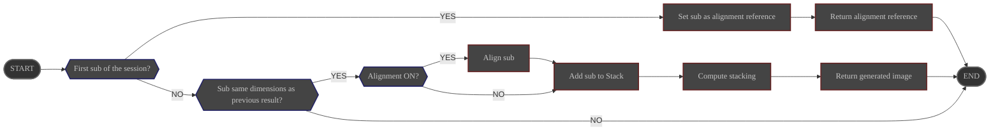

# Overview

The **Stacker** module handles the alignment and stacking of calibrated subs.

# Configuration

|                     | Source                                                                 | Data type                   | Required | Default value |
|---------------------|------------------------------------------------------------------------|-----------------------------|----------|---------------|
| Alignment ON/OFF    | Interface: [Stacking controls](../../userguide/ui/controls/#controls)  | ON/OFF                      | ∅        | ON            |
| Stacking mode       | Interface: [Stacking controls](../../userguide/ui/controls/#controls)  | choices: - mean - sum | YES      | mean          |
| Minimum matches     | Interface: [Stacking controls](../../userguide/ui/controls/#threshold) | integer                     | YES      | 25            |

# Control

The **Stack** module is launched in the background at ALS startup

| Source                     | Type      | Response           |
|----------------------------|-----------|--------------------|
| sub(s) in queue            | Event     | trigger processing |

# Input

| Data                        | Type  |
|-----------------------------|-------|
| sub at queue front          | Image |
| session alignment reference | Image |

# Behavior {#behavior}

## Alignment

**If alignment is ON**

1. Search for matches between the calibrated sub and the session **alignment reference**.

   ALS searches for matches on progressively larger centered areas of the image: **10%**, then **33%**, then the
   **full frame**. The first area producing at least the configured minimum number of matches is used to compute the
   transformation.

   Square 1:1 subs use a full-frame-only alignment search to avoid known alignment issues with square images.

   {}
   If no search area produces the configured minimum number of matches, the calibrated sub is **discarded** and the
   **Stack** module resumes listening to its queue.
   {}

2. Compute required transformations for the calibrated sub to align with the reference:
    - translations
    - rotation
    - resizing

3. Apply the transformations to the calibrated sub.

## Stacking

1. Add the aligned (if requested) sub to the stack.
2. Generate a new image containing the stacking result according to the configured mode.

When working in **mean** mode and the current profile is **Astrophoto**, ALS automatically removes transient bright artefacts
such as satellite trails by detecting and clipping per-pixel outliers. 

The stacker keeps a Welford-based running mean and variance for every pixel, and once at least **5** frames have been
accumulated it clips any new pixel sample that lies above the previous mean plus **5σ**.

Clipped values are replaced by the previous mean, providing single-pass, per-frame rejection without extra iterations.

# Output

The generated image is broadcast
