# Présentation

Le Traitement **DarkRemove** soustrait le signal thermique de l'image en utilisant un master dark
fourni par l'utilisateur.

Sa configuration est gérée via les préférences

# Configuration

|                       | Source                                                                                    | Type de donnée         | Requis | Valeur par défaut |
|-----------------------|-------------------------------------------------------------------------------------------|------------------------|--------|-------------------|
| ON/OFF                | Préférences : [Onglet Traitement](../../../userguide/preferences/processing/#dark-remove) | ON/OFF                 | ∅      | OFF               |
| Chemin du master dark | Préférences : [Onglet Traitement](../../../userguide/preferences/processing/#dark-remove) | chemin vers un fichier | OUI    | ∅                 |

# Contrôle

Ce traitement est contrôlé par le pipeline **Preprocess**

# Entrée

| Donnée                                       | Type  |
|----------------------------------------------|-------|
| image fournie par le pipeline **Preprocess** | Image |
| master dark lu depuis le chemin configuré    | Image |

# Comportement

```mermaid
graph LR

    START([START])
    
    TEST_ENABLED{{Ttaitement activé ?}}
    TEST_SIZE{{Dimensions identiques ?}}
    TEST_TYPE{{Types de données identiques ?}}
    
    CONVERT[Convertir master dark]
    SUBTRACT[Soustraire master dark de l'image]
    
    RETURN[Renvoyer image modifiée]
    UNCHANGED[Renvoyer image inchangée]
    
    END([END])
    
    START --> TEST_ENABLED
    
    TEST_ENABLED ----->|Non| UNCHANGED
    TEST_ENABLED -->|Oui| TEST_SIZE
    
    TEST_SIZE ----->|Non| UNCHANGED
    TEST_SIZE -->|Oui| TEST_TYPE
    
    TEST_TYPE -->|Non| CONVERT
    TEST_TYPE -->|Oui| SUBTRACT
    
    CONVERT --> SUBTRACT
    SUBTRACT --> RETURN
    
    RETURN --> END
    UNCHANGED --> END
    
    classDef bounds fill: #333, stroke: #666, stroke-width: 2px, color: #BBB, font-family: 'Poppins', sans-serif
    classDef step fill: #444, stroke: #622, stroke-width:2px, color: #c6c6c6, font-family: 'Poppins',sans-serif
    classDef wait  fill: #444, stroke: #262,stroke-width: 2px, color: #c6c6c6, font-family:'Poppins', sans-serif
    classDef test fill: #444, stroke: #226, stroke-width: 2px, color: #c6c6c6, font-family: 'Poppins', sans-serif
    
    class TEST_ENABLED,TEST_SIZE,TEST_TYPE test
    class START,END bounds
    class RETURN,UNCHANGED,CONVERT,SUBTRACT step
```

Le master dark est soustrait de l'image

- Si les types de données sont différents, le master dark est converti en le même type de données que l'image avant la soustraction.
- Si les dimensions sont différentes, le traitement est interrompu et l'image **non modifiée** est renvoyée au module **Preprocess**

# Sortie

L'image modifiée est renvoyée au pipeline **Preprocess**
