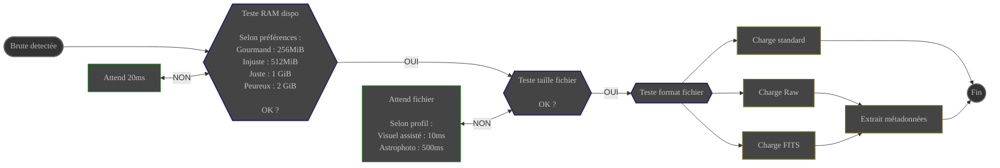

# Présentation

Le module **Scanner** est le point d'entrée de vos brutes dans ALS.

Il est en charge de :
- surveiller l'**apparition** des brutes dans le **dossier scanné**
- charger les brutes détectées

{}
ℹ️ **Les fichiers existants sont ignorés**

Les fichiers présents dans le **dossier scanné** avant le démarrage du module **Scanner** ne sont pas détectés
{}

{}
ℹ️ **La détection des brutes est récursive**

Les brutes sont détectées quel que soit le niveau de sous-dossiers où elles apparaissent au sein du **dossier scanné**

Même si elles sont enregistrées dans des sous-dossiers créés après le démarrage du module **Scanner**
{}

# Configuration
|                     | Source                                                                           | Type de donnée         | Requis | Valeur par défaut |
|---------------------|----------------------------------------------------------------------------------|------------------------|--------|-------------------|
| **Dossier scanné**  | Préférences : [Onglet Général](../../userguide/preferences/general/#scan-folder) | Chemin vers un dossier | Oui    | ∅                 |
| **Profil**          | Préférences : [Onglet Général](../../userguide/preferences/general/#profile)     | choix : VA / photo  | Oui    | VA                |
| **Gestion mémoire** | Préférences : [Onglet Général](../../userguide/preferences/general/#memory)      | mystérieux             | Oui    | "Injuste"         |
# Contrôle

| Source                                                                                  | Type                                  | Réponse                              |
|-----------------------------------------------------------------------------------------|---------------------------------------|--------------------------------------|
| Interface : [Contrôles de session](../../userguide/ui/controls/#session-controls)       | Commande : STOP                       | Surveillance du dossier scanné : OFF |
| Interface : [Contrôles de session](../../userguide/ui/controls/#session-controls)       | Commande : START                      | Surveillance du dossier scanné : ON  |
| Événement système                                                                       | brute détectée dans le dossier scanné | Charge la brute détectée             |

# Entrée

| Donnée                      | Type                   |
|-----------------------------|------------------------|
| chemin de la brute détectée | Chemin vers un fichier |

# Comportement

## Test RAM dispo {#ram}

Attend que la quantité de RAM disponible soit supérieure à la valeur configurée :

| Gestion mémoire | Quantité de Mémoire laissée au système |
|-----------------|----------------------------------------|
| Gourmand        | 256MiB                                 |
| Injuste         | 512MiB                                 |
| Juste           | 1GiB                                   |
| Peureux         | 2GiB                                   |

## Attente fichier complet {#wait}

Les fichiers sont détectés dès leur **apparition** dans le **dossier scanné**

Il faut s'assurer que le fichier est complet avant de le charger en mémoire.

- Interroge en boucle la taille du fichier détecté
    - Vérifie que la taille du fichier est stable sur 2 interrogations consécutives

Le temps d'attente entre les interrogations dépend du profil configuré :

| profil         | temps d'attente entre 2 interrogations |
|----------------|----------------------------------------|
| Visuel assisté | 10ms                                   |
| Astrophoto     | 1500ms                                 |

## Chargement de l'image {#load}

Le fichier est chargé en mémoire en utilisant le format correspondant à son extension :

| Extension                                                        | Format |
|------------------------------------------------------------------|--------|
| 
.jpg .jpeg
         | JPEG   |
| .png                | PNG    |
| 
.tiff .tif
         | TIFF   |
| 
.fits .fit .fts
 | FITS   |
| Toutes les autres extensions                                     | Raw    | 

Les fichiers Raw sont chargés en utilisant la librairie libRaw. Voir la 
[Liste des appareils photo pris en charge](https://www.libraw.org/supported-cameras) 

## Extraction de métadonnées

Prise en charge pour les formats :
- **FITS**
- **Raw**

Métadonnées extraites du fichier et incorporées à l'image en mémoire :
- **Temps d'exposition**
- **Matrice de Bayer** (_pour les brutes issues d'un capteur couleur_)
    - fichiers FITS : entête **BAYERPAT**
    - fichiers Raw : entête Exif standard

# Sortie

L'image chargée est diffusée pour qui veut bien s'en occuper.

⚙️ _ALS placera l'image dans la file d'attente du module **Preprocess** pour la calibration_
