# Présentation

Le module **Stacker** prend en charge l'alignement et l'empilement des brutes calibrées

# Configuration

|                            | Source                                                                      | Type de donnée                  | Requis | Valeur par défaut |
|----------------------------|-----------------------------------------------------------------------------|---------------------------------|--------|-------------------|
| Activation de l'alignement | Interface : [Contrôles de stacking](../../userguide/ui/controls/#controls)  | ON/OFF                          | ∅      | ON                |
| Mode d'empilement          | Interface : [Contrôles de stacking](../../userguide/ui/controls/#controls)  | choix : - moyenne - somme | OUI    | moyenne           |
| Seuil de détection         | Interface : [Contrôles de stacking](../../userguide/ui/controls/#threshold) | entier                          | OUI    | 25                |

# Contrôle

Le module **Stack** est lancé en tâche de fond au démarrage d'ALS

| Source                     | Type          | Réponse             |
|----------------------------|---------------|---------------------|
| brute(s) en file d'attente | Événement     | lance le traitement |

# Entrée

| Description                          | Type  |
|--------------------------------------|-------|
| brute en tête de file d'attente      | Image |
| référence d'alignement de la session | Image |

# Comportement {#behavior}

```mermaid
flowchart LR
    Start([START])
    FirstSub{{Première brute de la session ?}}
    SetAlignReference[Enregistrer la brute comme référence d'alignement]
    CheckShape{{Brute de même dimensions que le réusltat précédent ?}}
    CheckAlign{{Alignement actif ?}}
    AlignImage[Aligner brute]
    StackImage[Ajouter brute à la Stack]
    ComputeStacking[Calculer le stacking]
    PublishReference[Renvoyer la référence d'alignement]
    PublishResult[Renvoyer l'image générée]
    End([END])

    Start --> FirstSub
    FirstSub -- OUI --> SetAlignReference
    SetAlignReference --> PublishReference
    FirstSub -- NON --> CheckShape
    CheckShape -- OUI --> CheckAlign
    CheckAlign -- OUI --> AlignImage
    AlignImage --> StackImage
    CheckAlign -- NON --> StackImage
    StackImage --> ComputeStacking
    ComputeStacking --> PublishResult
    CheckShape -- NON --> End
    PublishReference --> End
    PublishResult --> End
    
    classDef bounds fill: #333, stroke: #666, stroke-width: 2px, color: #BBB, font-family: 'Poppins', sans-serif
    classDef step fill: #444, stroke: #622, stroke-width:2px, color: #c6c6c6, font-family: 'Poppins',sans-serif
    classDef test fill: #444, stroke: #226, stroke-width: 2px, color: #c6c6c6, font-family: 'Poppins', sans-serif
    
    class Start,End bounds
    class SetAlignReference,AlignImage,StackImage,PublishResult,ComputeStacking,PublishReference step
    class CheckShape,CheckAlign,FirstSub test
```

## Alignement

**Si l'alignement est activé**

1. recherche des similitudes entre la brute calibrée et la **référence d'alignement** de la session.

   {}
   Si la brute calibrée présente un nombre de similitudes **inférieur** au seuil de détection configuré, elle est
   **abandonnée** et le module **Stack** se remet à l'écoute de sa file d'attente.
   {}

2. calcul des transformations nécessaires pour que la brute calibrée soit alignée sur la référence
    - translations
    - rotation
    - redimensionnements

3. application des transformations à la brute calibrée

## Empilement

1. Ajout de la brute alignée (si demandé) à la pile
2. Génération d'une nouvelle image contenant le résultat de l'empilement selon le mode configuré

# Sortie

L'image générée est diffusée