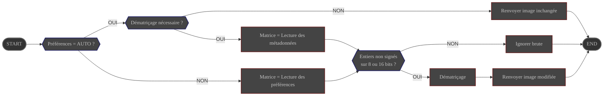

# Présentation

Le Traitement **DeBayer** est utilisé sur les images **couleur** au format **FITS** ou **Raw**.

Il consiste à générer une image couleur à partir de l'image brute et de la description de la matrice de Bayer
à utiliser.

Sa configuration est gérée via les préférences

# Configuration

|                  | Source                                                                                | Type de donnée                                            | Requis  | Valeur par défaut |
|------------------|---------------------------------------------------------------------------------------|-----------------------------------------------------------|---------|-------------------|
| Matrice de Bayer | Préférences : [Onglet Traitement](../../../userguide/preferences/processing/#debayer) | choix : - AUTO - GRBG - RGGB - GBRG - BGGR | OUI     | AUTO              |

# Contrôle

Ce traitement est contrôlé par le module **Preprocess**

# Entrée

| Donnée                                       | Type  |
|----------------------------------------------|-------|
| image fournie par le module **Preprocess**   | Image |

# Comportement

L'image brute est convertie en image couleur en utilisant la matrice de Bayer configurée.

- si la matrice configurée est définie sur **AUTO**, la matrice est extraite des métadonnées de l'image.

{}
Les brutes à dématricer doivent être de type : entiers non signés sur 8 ou 16 bits. Les
brutes utilisant un autre type de données ne peuvent pas être dématricées et sont ignorées.
{}

# Sortie

- Les brutes dématricées avec succès sont renvoyées au module **Preprocess** sous forme d'images couleur modifiées.
- Lorsque la préférence de matrice de Bayer est définie sur **AUTO**, les brutes mono et les brutes couleur déjà
  dématricées sont renvoyées sans modification.
- Les brutes ne pouvant pas être dématricées sont ignorées et ne produisent aucune sortie.
