# Présentation

Le processus **FlatCalibrate** divise chaque brute scientifique par un **master flat** fourni par
l'utilisateur afin de supprimer le vignettage optique, les poussières et les variations de réponse
inter-pixels.

Sa configuration est gérée via la page de préférences d'ALS.

# Configuration

|                        | Source                                                                                  | Type de donnée | Obligatoire | Valeur par défaut |
|------------------------|-----------------------------------------------------------------------------------------|----------------|-------------|-------------------|
| ON/OFF                 | Préférences : [onglet Traitement](../../../userguide/preferences/processing/#flat-calibrate) | ON/OFF         | ∅           | OFF               |
| Chemin du master flat  | Préférences : [onglet Traitement](../../../userguide/preferences/processing/#flat-calibrate) | Chemin de fichier | Oui      | ∅                 |
| Normalisation du flat  | Préférences : [onglet Traitement](../../../userguide/preferences/processing/#flat-calibrate) | choix :  - MEDIAN - MEAN | Non | MEDIAN |

# Contrôle

Ce processus est déclenché par le pipeline **Preprocess**.

# Entrée

| Donnée                                       | Type  |
|----------------------------------------------|-------|
| image reçue du pipeline **Preprocess**       | Image |
| master flat lu depuis le chemin configuré    | Image |

# Comportement

```mermaid
graph LR

START([START])

TEST_ENABLED{{Traitement activé ?}}
TEST_SIZE{{Dimensions identiques ?}}
TEST_TYPE{{Types de données identiques ?}}
TEST_STATS{{Statistique de normalisation valide ?}}

NORMALIZE[Normaliser le master flat]
DIVIDE[Diviser l'image par le flat normalisé]
RETURN[Retourner l'image calibrée]
UNCHANGED[Retourner l'image inchangée]

END([END])

START --> TEST_ENABLED

TEST_ENABLED ----->|Non| UNCHANGED
TEST_ENABLED -->|Oui| TEST_SIZE

TEST_SIZE ----->|Non| UNCHANGED
TEST_SIZE -->|Oui| TEST_TYPE

TEST_TYPE -->|Non| NORMALIZE
TEST_TYPE -->|Oui| TEST_STATS

TEST_STATS ----->|Non| NORMALIZE
TEST_STATS -->|Oui| NORMALIZE

NORMALIZE --> DIVIDE
DIVIDE --> RETURN

RETURN --> END
UNCHANGED --> END

classDef bounds fill: #333, stroke: #666, stroke-width: 2px, color: #BBB, font-family: 'Poppins', sans-serif
classDef step fill: #444, stroke: #622, stroke-width:2px, color: #c6c6c6, font-family: 'Poppins',sans-serif
classDef wait  fill: #444, stroke: #262,stroke-width: 2px, color: #c6c6c6, font-family:'Poppins', sans-serif
classDef test fill: #444, stroke: #226, stroke-width: 2px, color: #c6c6c6, font-family: 'Poppins', sans-serif

class TEST_ENABLED,TEST_SIZE,TEST_TYPE,TEST_STATS test
class START,END bounds
class RETURN,UNCHANGED,NORMALIZE,DIVIDE step
```

Le master flat est d'abord normalisé avec la statistique choisie avant que la brute ne soit divisée par celui-ci.

- Si la statistique configurée est indisponible ou si le flat contient des pixels invalides (zéros ou NaNs),
  le traitement revient à une normalisation médiane.
- Si les dimensions ou les types de données ne correspondent pas, le traitement s'interrompt et renvoie
  l'image **non modifiée** au module **Preprocess**.
- L'image résultante conserve la dynamique grâce à la ré-application de la statistique utilisée lors de la
  normalisation.

# Sortie

L'image calibrée est renvoyée au pipeline **Preprocess**.
