# Présentation

Le processus **RemoveFlat** divise chaque brute par un **master flat** fourni par
l'utilisateur afin de supprimer le vignettage optique, les poussières et les variations de réponse
inter-pixels.

Sa configuration est gérée via la page de préférences d'ALS.

# Configuration

|                        | Source                                                                                      | Type de donnée    | Obligatoire | Valeur par défaut |
|------------------------|---------------------------------------------------------------------------------------------|-------------------|-------------|-------------------|
| ON/OFF                 | Préférences: [onglet Traitement](../../../userguide/preferences/processing/#flat-calibrate) | ON/OFF            | ∅           | OFF               |
| Chemin du master flat  | Préférences: [onglet Traitement](../../../userguide/preferences/processing/#flat-calibrate) | Chemin de fichier | Oui         | ∅                 |

# Contrôle

Ce processus est déclenché par le pipeline **Preprocess**.

# Entrée

| Donnée                                       | Type  |
|----------------------------------------------|-------|
| image reçue du pipeline **Preprocess**       | Image |
| master flat lu depuis le chemin configuré    | Image |

# Comportement

```mermaid
graph LR

START([START])

TEST_ENABLED{{Traitement activé ?}}
READ_FLAT[Lire le master flat]
TEST_SHAPE{{Dimensions identiques ?}}
NORMALIZE[Normaliser par la valeur maximale]
SAFEGUARD[Remplacer les zéros par des uns]
DIVIDE[Diviser l'image par le flat normalisé]
CLIP[Limiter à la plage 16 bits]
RETURN[Retourner l'image calibrée]
UNCHANGED[Retourner l'image inchangée]

END([END])

START --> TEST_ENABLED

TEST_ENABLED ----->|Non| UNCHANGED
TEST_ENABLED -->|Oui| READ_FLAT

READ_FLAT ----->|Échec| UNCHANGED
READ_FLAT -->|Ok| TEST_SHAPE

TEST_SHAPE ----->|Non| UNCHANGED
TEST_SHAPE -->|Oui| NORMALIZE

NORMALIZE --> SAFEGUARD
SAFEGUARD --> DIVIDE
DIVIDE --> CLIP
CLIP --> RETURN

RETURN --> END
UNCHANGED --> END

classDef bounds fill: #333, stroke: #666, stroke-width: 2px, color: #BBB, font-family: 'Poppins', sans-serif
classDef step fill: #444, stroke: #622, stroke-width:2px, color: #c6c6c6, font-family: 'Poppins',sans-serif
classDef wait  fill: #444, stroke: #262,stroke-width: 2px, color: #c6c6c6, font-family:'Poppins', sans-serif
classDef test fill: #444, stroke: #226, stroke-width: 2px, color: #c6c6c6, font-family: 'Poppins', sans-serif

class TEST_ENABLED,TEST_SHAPE test
class START,END bounds
class RETURN,UNCHANGED,READ_FLAT,NORMALIZE,SAFEGUARD,DIVIDE,CLIP step
```

Le master flat est chargé depuis le disque, normalisé par sa valeur maximale, puis les zéros sont remplacés
par des uns avant la division de l'image scientifique.

- Si le master flat ne peut pas être lu ou que ses dimensions diffèrent de celles de l'image scientifique,
  la division est ignorée et la brute **non modifiée** est renvoyée au module **Preprocess**.
- Après la division, les pixels sont limités à la plage 16 bits et convertis en entiers non signés 16 bits
  afin de préserver la compatibilité avec le reste de la chaîne de traitement.

# Sortie

La brute calibrée est renvoyée au pipeline **Preprocess**.
