# Présentation

Le traitement **FlatCalibration** supprime les variations d'éclairage pixel à pixel en normalisant l'image
avec un master flat fourni par l'utilisateur.

Sa configuration est gérée via la page des préférences d'ALS.

# Configuration

|                        | Source                                                                                     | Type de donnée        | Requis | Valeur par défaut |
|------------------------|---------------------------------------------------------------------------------------------|-----------------------|--------|-------------------|
| ON/OFF                 | Préférences : [Onglet Traitement](../../../userguide/preferences/processing/#flat)          | ON/OFF                | ∅      | OFF               |
| Chemin du master flat  | Préférences : [Onglet Traitement](../../../userguide/preferences/processing/#flat)          | Chemin vers un fichier | OUI    | ∅                 |
| Normalisation auto     | Préférences : [Onglet Traitement](../../../userguide/preferences/processing/#flat)          | ON/OFF                | ∅      | ON                |
| ROI de normalisation   | Préférences : [Onglet Traitement](../../../userguide/preferences/processing/#flat)          | Rectangle             | Non    | Pleine image      |

# Contrôle

Ce traitement est déclenché par le pipeline **Preprocess** après la soustraction de dark et avant le débayering.

# Entrée

| Donnée                                       | Type  |
|----------------------------------------------|-------|
| image fournie par le pipeline **Preprocess** | Image |
| master flat lu depuis le chemin configuré    | Image |

# Comportement

```mermaid
graph LR

START([START])

TEST_ENABLED{{Traitement activé ?}}
TEST_SIZE{{Dimensions identiques ?}}
TEST_TYPE{{Types de données identiques ?}}
TEST_NORMALIZE{{Normalisation nécessaire ?}}
TEST_SAFE{{Master flat exploitable ?}}

LOAD[Chargement du master flat]
NORM[Normaliser le master flat]
CALIBRATE[Diviser l'image par le master flat]
RETURN[Retourner l'image modifiée]
UNCHANGED[Retourner l'image inchangée]

END([END])

START --> TEST_ENABLED
TEST_ENABLED -- Non --> UNCHANGED
TEST_ENABLED -- Oui --> LOAD

LOAD --> TEST_SAFE
TEST_SAFE -- Non --> UNCHANGED
TEST_SAFE -- Oui --> TEST_SIZE

TEST_SIZE -- Non --> UNCHANGED
TEST_SIZE -- Oui --> TEST_TYPE

TEST_TYPE -- Non --> NORM
TEST_TYPE -- Oui --> TEST_NORMALIZE

NORM --> TEST_NORMALIZE
TEST_NORMALIZE -- Oui --> CALIBRATE
TEST_NORMALIZE -- Non --> CALIBRATE

CALIBRATE --> RETURN
RETURN --> END
UNCHANGED --> END

classDef bounds fill:#333,stroke:#666,stroke-width:2px,color:#BBB,font-family:'Poppins',sans-serif
classDef step fill:#444,stroke:#622,stroke-width:2px,color:#c6c6c6,font-family:'Poppins',sans-serif
classDef test fill:#444,stroke:#226,stroke-width:2px,color:#c6c6c6,font-family:'Poppins',sans-serif

class START,END bounds
class LOAD,NORM,CALIBRATE,RETURN,UNCHANGED step
class TEST_ENABLED,TEST_SIZE,TEST_TYPE,TEST_NORMALIZE,TEST_SAFE test
```

Le master flat est chargé puis éventuellement normalisé avant d'être utilisé pour calibrer l'image entrante.

- Si les dimensions diffèrent, le traitement est abandonné et l'image **non modifiée** est renvoyée au module **Preprocess**.
- Si les types de données diffèrent, le master flat est converti pour correspondre à l'image avant la calibration.
- Si la normalisation automatique est activée, le master flat est mis à l'échelle pour que sa valeur moyenne sur la ROI sélectionnée soit égale à 1,0.
- Les pixels susceptibles de provoquer une division par zéro sont limités à une valeur minimale sûre avant l'étape de calibration.

# Sortie

L'image calibrée est renvoyée au pipeline **Preprocess**.
