# Présentation

Le module **Stacker** prend en charge l'alignement et l'empilement des brutes calibrées

# Configuration

|                            | Source                                                                      | Type de donnée                  | Requis | Valeur par défaut |
|----------------------------|-----------------------------------------------------------------------------|---------------------------------|--------|-------------------|
| Activation de l'alignement | Interface : [Contrôles de stacking](../../userguide/ui/controls/#controls)  | ON/OFF                          | ∅      | ON                |
| Mode d'empilement          | Interface : [Contrôles de stacking](../../userguide/ui/controls/#controls)  | choix : - moyenne - somme | OUI    | moyenne           |
| Correspondances minimales  | Interface : [Contrôles de stacking](../../userguide/ui/controls/#threshold) | entier                          | OUI    | 25                |

# Contrôle

Le module **Stack** est lancé en tâche de fond au démarrage d'ALS

| Source                     | Type          | Réponse             |
|----------------------------|---------------|---------------------|
| brute(s) en file d'attente | Événement     | lance le traitement |

# Entrée

| Description                          | Type  |
|--------------------------------------|-------|
| brute en tête de file d'attente      | Image |
| référence d'alignement de la session | Image |

# Comportement {#behavior}

```mermaid
flowchart LR
    Start([START])
    FirstSub{{Première brute de la session ?}}
    SetAlignReference[Enregistrer la brute comme référence d'alignement]
    CheckShape{{Brute de même dimensions que le résultat précédent ?}}
    CheckAlign{{Alignement actif ?}}
    AlignImage[Aligner brute]
    StackImage[Ajouter brute à la Stack]
    ComputeStacking[Calculer le stacking]
    PublishReference[Renvoyer la référence d'alignement]
    PublishResult[Renvoyer l'image générée]
    End([END])

    Start --> FirstSub
    FirstSub -- OUI --> SetAlignReference
    SetAlignReference --> PublishReference
    FirstSub -- NON --> CheckShape
    CheckShape -- OUI --> CheckAlign
    CheckAlign -- OUI --> AlignImage
    AlignImage --> StackImage
    CheckAlign -- NON --> StackImage
    StackImage --> ComputeStacking
    ComputeStacking --> PublishResult
    CheckShape -- NON --> End
    PublishReference --> End
    PublishResult --> End
    
    classDef bounds fill: #333, stroke: #666, stroke-width: 2px, color: #BBB, font-family: 'Poppins', sans-serif
    classDef step fill: #444, stroke: #622, stroke-width:2px, color: #c6c6c6, font-family: 'Poppins',sans-serif
    classDef test fill: #444, stroke: #226, stroke-width: 2px, color: #c6c6c6, font-family: 'Poppins', sans-serif
    
    class Start,End bounds
    class SetAlignReference,AlignImage,StackImage,PublishResult,ComputeStacking,PublishReference step
    class CheckShape,CheckAlign,FirstSub test
```

## Alignement

**Si l'alignement est activé**

1. recherche des correspondances entre la brute calibrée et la **référence d'alignement** de la session.

   ALS recherche les correspondances sur des zones centrées progressivement plus grandes de l'image : **10 %**, puis
   **33 %**, puis l'**image complète**. La première zone produisant au moins le nombre minimal de correspondances
   configuré est utilisée pour calculer la transformation.

   Les brutes carrées au format 1:1 utilisent une recherche uniquement sur l'image complète afin d'éviter les
   problèmes d'alignement connus avec les images carrées.

   {}
   Si aucune zone de recherche ne produit le nombre minimal de correspondances configuré, la brute calibrée est
   **abandonnée** et le module **Stack** se remet à l'écoute de sa file d'attente.
   {}

2. calcul des transformations nécessaires pour que la brute calibrée soit alignée sur la référence
    - translations
    - rotation
    - redimensionnements

3. application des transformations à la brute calibrée

## Empilement

1. Ajout de la brute alignée (si demandé) à la pile
2. Génération d'une nouvelle image contenant le résultat de l'empilement selon le mode configuré

En mode **moyenne** et lorsque le profil actif est **Astrophoto**, ALS effectue une moyenne avec rejet sigma-clippé pour
supprimer les artefacts lumineux transitoires comme les traînées de satellites. 

Le Stacker conserve une moyenne et une variance glissantes basées sur l'algorithme en ligne de Welford pour chaque pixel,
et dès qu'au moins **5** brutes sont accumulées, toute nouvelle valeur de pixel dépassant la moyenne précédente de plus
de **5σ** est remplacée par la moyenne précédente.

Ce rejet par pixel se fait en un seul passage, sans itérations supplémentaires.

# Sortie

L'image générée est diffusée
